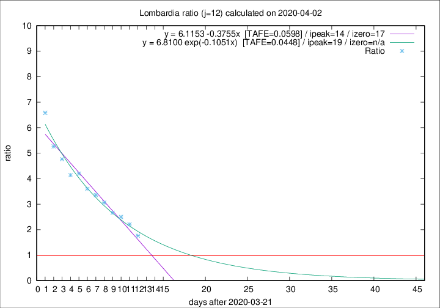

# Lombardia

Data source: https://raw.githubusercontent.com/pcm-dpc/COVID-19/master/dati-json/dpc-covid19-ita-regioni.json

Delta days analysis (j): 12

Analyses for other values of j for 2020-04-02 are avalable [here](../2020-04-02/README.md)

Analyses for Lombardia for previous dates are avalable [here](../README.md)

## Fitting 
|fit type|best fit equation|tafe|tfe|ipeak|izero|
|-------|-----|--------|------|---|---|
|linear|y = 6.1153 -0.3755x  [TAFE=0.0598]|0.0598|-0.0021|14|17|
|exp|y = 6.8100 exp(-0.1051x)  [TAFE=0.0448]|0.0448|0.0010|19|n/a|

## Data
|Date|Daily deaths|Cumulated deaths|Deaths in the last 12 days|Deaths in the 12 days before|ratio|
|----|----------|-----------|-------|--------------------|-----|
|2020-04-02|367|7960|4865|2762|1.7614|
|2020-04-01|394|7593|5044|2282|2.2103|
|2020-03-31|381|7199|5031|2014|2.4980|
|2020-03-30|458|6818|4859|1824|2.6639|
|2020-03-29|416|6360|4720|1542|3.0610|
|2020-03-28|542|5944|4524|1347|3.3586|
|2020-03-27|541|5402|4184|1163|3.5976|
|2020-03-26|387|4861|3895|928|4.1972|
|2020-03-25|296|4474|3584|866|4.1386|
|2020-03-24|402|4178|3434|721|4.7628|
|2020-03-23|320|3776|3159|600|5.2650|
|2020-03-22|361|3456|2988|454|6.5815|

[Download data as CSV](COVID-19_lombardia_j12_2020-04-02.csv)

Generated April 16th, 2020 at 20:09:19 UTC+0200 with https://github.com/robianc/COVID-19
