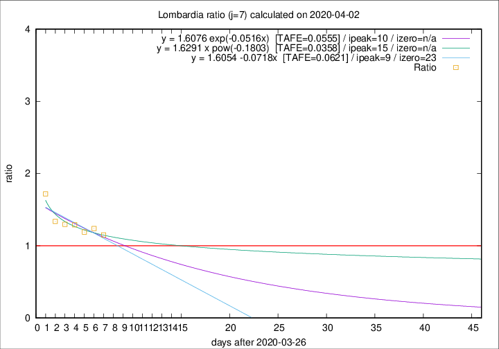

# Lombardia

Data source: https://raw.githubusercontent.com/pcm-dpc/COVID-19/master/dati-json/dpc-covid19-ita-regioni.json

Delta days analysis (j): 7

Analyses for other values of j for 2020-04-02 are avalable [here](../2020-04-02/README.md)

Analyses for Lombardia for previous dates are avalable [here](../README.md)

## Fitting 
|fit type|best fit equation|tafe|tfe|ipeak|izero|
|-------|-----|--------|------|---|---|
|linear|y = 1.6054 -0.0718x  [TAFE=0.0621]|0.0621|0.0041|9|23|
|exp|y = 1.6076 exp(-0.0516x)  [TAFE=0.0555]|0.0555|0.0019|10|n/a|
|pow|y = 1.6291 x pow(-0.1803)  [TAFE=0.0358]|0.0358|0.0008|15|n/a|

## Data
|Date|Daily deaths|Cumulated deaths|Deaths in the last 7 days|Deaths in the 7 days before|ratio|
|----|----------|-----------|-------|--------------------|-----|
|2020-04-02|367|7960|3099|2693|1.1508|
|2020-04-01|394|7593|3119|2515|1.2402|
|2020-03-31|381|7199|3021|2538|1.1903|
|2020-03-30|458|6818|3042|2356|1.2912|
|2020-03-29|416|6360|2904|2238|1.2976|
|2020-03-28|542|5944|2849|2129|1.3382|
|2020-03-27|541|5402|2853|1659|1.7197|

[Download data as CSV](COVID-19_lombardia_j7_2020-04-02.csv)

Generated April 14th, 2020 at 19:16:04 UTC+0200 with https://github.com/robianc/COVID-19
