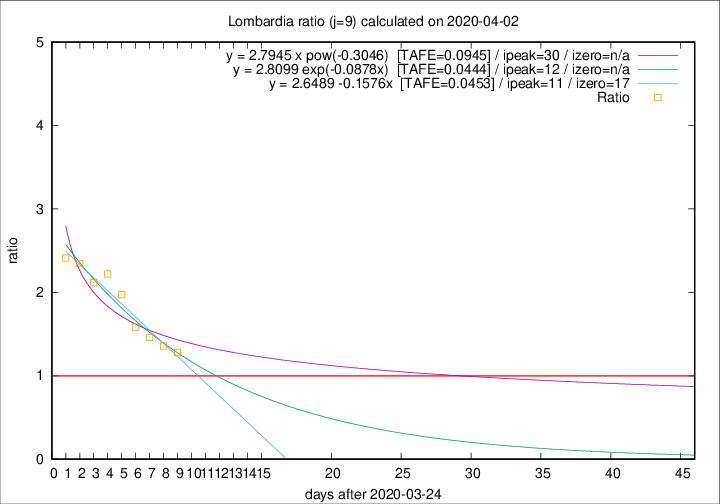

# Lombardia

Data source: https://raw.githubusercontent.com/pcm-dpc/COVID-19/master/dati-json/dpc-covid19-ita-regioni.json

Delta days analysis (j): 9

## Fitting 
|fit type|best fit equation|tafe|tfe|ipeak|izero|
|-------|-----|--------|------|---|---|
|linear|y = 2.6489 -0.1576x  [TAFE=0.0453]|0.0453|0.0031|11|17|
|exp|y = 2.8099 exp(-0.0878x)  [TAFE=0.0444]|0.0444|0.0014|12|n/a|
|pow|y = 2.7945 x pow(-0.3046)  [TAFE=0.0945]|0.0945|0.0059|30|n/a|

## Data
|Date|Daily deaths|Cumulated deaths|Deaths in the last 9 days|Deaths in the 9 days before|ratio|
|----|----------|-----------|-------|--------------------|-----|
|2020-04-02|367|7960|3782|2960|1.2777|
|2020-04-01|394|7593|3817|2810|1.3584|
|2020-03-31|381|7199|3743|2566|1.4587|
|2020-03-30|458|6818|3723|2351|1.5836|
|2020-03-29|416|6360|3811|1932|1.9726|
|2020-03-28|542|5944|3776|1700|2.2212|
|2020-03-27|541|5402|3443|1626|2.1175|
|2020-03-26|387|4861|3221|1373|2.3460|
|2020-03-25|296|4474|3054|1266|2.4123|

[Download data as CSV](COVID-19_lombardia_j9_2020-04-02.csv)

Generated April 8th, 2020 at 23:43:36 UTC+0200 with https://github.com/robianc/COVID-19
