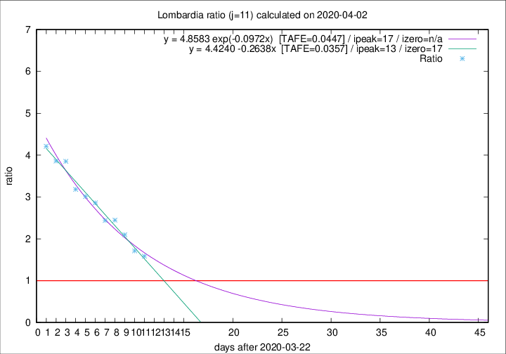

# Lombardia

Data source: https://raw.githubusercontent.com/pcm-dpc/COVID-19/master/dati-json/dpc-covid19-ita-regioni.json

Estimates in this page were made on 10/4/2020 with data available until 02/04/2020.

## Summary 

### Peak estimate 
|j|linear [TAFE]|exponential [TAFE]|power law [TAFE]|details|
|---|----|-----------|---------|-------|
|7|5/4/2020 [TAFE=0.0621]|6/4/2020 [TAFE=0.0555]|11/4/2020 [TAFE=0.0358]|[analysis](COVID-19_lombardia_j7_2020-04-02.md)|
|8|4/4/2020 [TAFE=0.0670]|5/4/2020 [TAFE=0.0607]|13/4/2020 [TAFE=0.0667]|[analysis](COVID-19_lombardia_j8_2020-04-02.md)|
|9|5/4/2020 [TAFE=0.0453]|6/4/2020 [TAFE=0.0444]|24/4/2020 [TAFE=0.0945]|[analysis](COVID-19_lombardia_j9_2020-04-02.md)|
|10|5/4/2020 [TAFE=0.0500]|7/4/2020 [TAFE=0.0430]|1/5/2020 [TAFE=0.0882]|[analysis](COVID-19_lombardia_j10_2020-04-02.md)|
|11|5/4/2020 [TAFE=0.0357]|9/4/2020 [TAFE=0.0447]|22/5/2020 [TAFE=0.1125]|[analysis](COVID-19_lombardia_j11_2020-04-02.md)|
|12|5/4/2020 [TAFE=0.0598]|10/4/2020 [TAFE=0.0448]|1/6/2020 [TAFE=0.0980]|[analysis](COVID-19_lombardia_j12_2020-04-02.md)|
|13|4/4/2020 [TAFE=0.1638]|10/4/2020 [TAFE=0.0650]|29/5/2020 [TAFE=0.0894]|[analysis](COVID-19_lombardia_j13_2020-04-02.md)|
|14|-|-|-||

Best estimator is linear with j=11 (TAFE=0.0357)
Corresponding peak date estimate is 5/4/2020 (ipeak 13)

Peak date range estimate: 23/3/2020 - 2/6/2020

### End estimate 
|j|linear [TAFE/TFE]|exponential [TAFE/TFE]|power law [TAFE/TFE]|details|
|---|----|-----------|---------|-------|
|7|19/4/2020 [TAFE=0.0621]|-|-|[analysis](COVID-19_lombardia_j7_2020-04-02.md)|
|8|-|-|-|[analysis](COVID-19_lombardia_j8_2020-04-02.md)|
|9|11/4/2020 [TAFE=0.0453]|-|-|[analysis](COVID-19_lombardia_j9_2020-04-02.md)|
|10|-|-|-|[analysis](COVID-19_lombardia_j10_2020-04-02.md)|
|11|9/4/2020 [TAFE=0.0357]|-|-|[analysis](COVID-19_lombardia_j11_2020-04-02.md)|
|12|-|-|-|[analysis](COVID-19_lombardia_j12_2020-04-02.md)|
|13|-|-|-|[analysis](COVID-19_lombardia_j13_2020-04-02.md)|
|14|-|-|-||

Best estimator is linear with j=11 (TAFE=0.0357)
Corresponding end date estimate is 9/4/2020 (izero 17)

End date range estimate: 23/3/2020 - 15/4/2020

Generated April 10th, 2020 at 17:26:10 UTC+0200 with https://github.com/robianc/COVID-19
