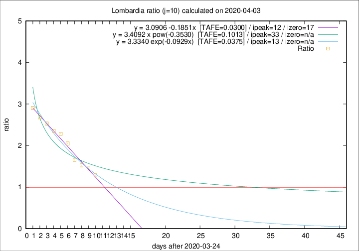

# Lombardia

Data source: https://raw.githubusercontent.com/pcm-dpc/COVID-19/master/dati-json/dpc-covid19-ita-regioni.json

Delta days analysis (j): 10

Analyses for other values of j for 2020-04-03 are avalable [here](../2020-04-03/README.md)

Analyses for Lombardia for previous dates are avalable [here](../README.md)

## Fitting 
|fit type|best fit equation|tafe|tfe|ipeak|izero|
|-------|-----|--------|------|---|---|
|linear|y = 3.0906 -0.1851x  [TAFE=0.0300]|0.0300|0.0013|12|17|
|exp|y = 3.3340 exp(-0.0929x)  [TAFE=0.0375]|0.0375|0.0010|13|n/a|
|pow|y = 3.4092 x pow(-0.3530)  [TAFE=0.1013]|0.1013|0.0065|33|n/a|

## Data
|Date|Daily deaths|Cumulated deaths|Deaths in the last 10 days|Deaths in the 10 days before|ratio|
|----|----------|-----------|-------|--------------------|-----|
|2020-04-03|351|8311|4133|3212|1.2867|
|2020-04-02|367|7960|4184|2886|1.4498|
|2020-04-01|394|7593|4137|2712|1.5254|
|2020-03-31|381|7199|4104|2478|1.6562|
|2020-03-30|458|6818|4269|2081|2.0514|
|2020-03-29|416|6360|4192|1835|2.2845|
|2020-03-28|542|5944|3985|1692|2.3552|
|2020-03-27|541|5402|3762|1486|2.5316|
|2020-03-26|387|4861|3441|1285|2.6778|
|2020-03-25|296|4474|3256|1120|2.9071|

[Download data as CSV](COVID-19_lombardia_j10_2020-04-03.csv)

Generated April 16th, 2020 at 20:09:19 UTC+0200 with https://github.com/robianc/COVID-19
