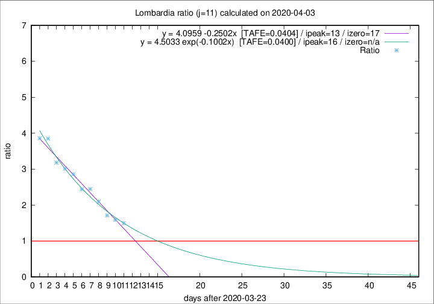

# Lombardia

Data source: https://raw.githubusercontent.com/pcm-dpc/COVID-19/master/dati-json/dpc-covid19-ita-regioni.json

Delta days analysis (j): 11

## Fitting 
|fit type|best fit equation|tafe|tfe|ipeak|izero|
|-------|-----|--------|------|---|---|
|linear|y = 4.0959 -0.2502x  [TAFE=0.0404]|0.0404|0.0004|13|17|
|exp|y = 4.5033 exp(-0.1002x)  [TAFE=0.0400]|0.0400|0.0013|16|n/a|

## Data
|Date|Daily deaths|Cumulated deaths|Deaths in the last 11 days|Deaths in the 11 days before|ratio|
|----|----------|-----------|-------|--------------------|-----|
|2020-04-03|351|8311|4535|3032|1.4957|
|2020-04-02|367|7960|4504|2839|1.5865|
|2020-04-01|394|7593|4498|2627|1.7122|
|2020-03-31|381|7199|4650|2216|2.0984|
|2020-03-30|458|6818|4650|1901|2.4461|
|2020-03-29|416|6360|4401|1805|2.4382|
|2020-03-28|542|5944|4304|1505|2.8598|
|2020-03-27|541|5402|3982|1322|3.0121|
|2020-03-26|387|4861|3643|1145|3.1817|
|2020-03-25|296|4474|3508|911|3.8507|
|2020-03-24|402|4178|3288|852|3.8592|

[Download data as CSV](COVID-19_lombardia_j11_2020-04-03.csv)

Generated April 8th, 2020 at 23:43:36 UTC+0200 with https://github.com/robianc/COVID-19
