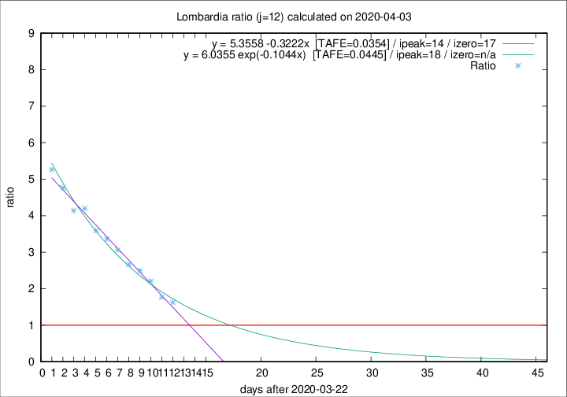

# Lombardia

Data source: https://raw.githubusercontent.com/pcm-dpc/COVID-19/master/dati-json/dpc-covid19-ita-regioni.json

Delta days analysis (j): 12

Analyses for other values of j for 2020-04-03 are avalable [here](../README.md)

Analyses for Lombardia for previous dates are avalable [here](../../README.md)

## Fitting 
|fit type|best fit equation|tafe|tfe|ipeak|izero|
|-------|-----|--------|------|---|---|
|linear|y = 5.3558 -0.3222x  [TAFE=0.0354]|0.0354|-0.0013|14|17|
|exp|y = 6.0355 exp(-0.1044x)  [TAFE=0.0445]|0.0445|0.0013|18|n/a|

## Data
|Date|Daily deaths|Cumulated deaths|Deaths in the last 12 days|Deaths in the 12 days before|ratio|
|----|----------|-----------|-------|--------------------|-----|
|2020-04-03|351|8311|4855|2988|1.6248|
|2020-04-02|367|7960|4865|2762|1.7614|
|2020-04-01|394|7593|5044|2282|2.2103|
|2020-03-31|381|7199|5031|2014|2.4980|
|2020-03-30|458|6818|4859|1824|2.6639|
|2020-03-29|416|6360|4720|1542|3.0610|
|2020-03-28|542|5944|4524|1347|3.3586|
|2020-03-27|541|5402|4184|1163|3.5976|
|2020-03-26|387|4861|3895|928|4.1972|
|2020-03-25|296|4474|3584|866|4.1386|
|2020-03-24|402|4178|3434|721|4.7628|
|2020-03-23|320|3776|3159|600|5.2650|

[Download data as CSV](COVID-19_lombardia_j12_2020-04-03.csv)

Generated April 10th, 2020 at 17:26:10 UTC+0200 with https://github.com/robianc/COVID-19
