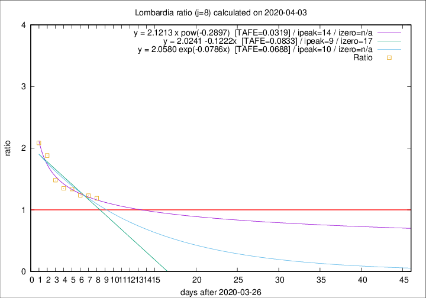

# Lombardia

Data source: https://raw.githubusercontent.com/pcm-dpc/COVID-19/master/dati-json/dpc-covid19-ita-regioni.json

Delta days analysis (j): 8

Analyses for other values of j for 2020-04-03 are avalable [here](../2020-04-03/README.md)

Analyses for Lombardia for previous dates are avalable [here](../README.md)

## Fitting 
|fit type|best fit equation|tafe|tfe|ipeak|izero|
|-------|-----|--------|------|---|---|
|linear|y = 2.0241 -0.1222x  [TAFE=0.0833]|0.0833|0.0055|9|17|
|exp|y = 2.0580 exp(-0.0786x)  [TAFE=0.0688]|0.0688|0.0027|10|n/a|
|pow|y = 2.1213 x pow(-0.2897)  [TAFE=0.0319]|0.0319|0.0007|14|n/a|

## Data
|Date|Daily deaths|Cumulated deaths|Deaths in the last 8 days|Deaths in the 8 days before|ratio|
|----|----------|-----------|-------|--------------------|-----|
|2020-04-03|351|8311|3450|2902|1.1888|
|2020-04-02|367|7960|3486|2834|1.2301|
|2020-04-01|394|7593|3415|2758|1.2382|
|2020-03-31|381|7199|3423|2558|1.3382|
|2020-03-30|458|6818|3362|2490|1.3502|
|2020-03-29|416|6360|3265|2205|1.4807|
|2020-03-28|542|5944|3395|1805|1.8809|
|2020-03-27|541|5402|3234|1551|2.0851|

[Download data as CSV](COVID-19_lombardia_j8_2020-04-03.csv)

Generated April 14th, 2020 at 19:16:04 UTC+0200 with https://github.com/robianc/COVID-19
