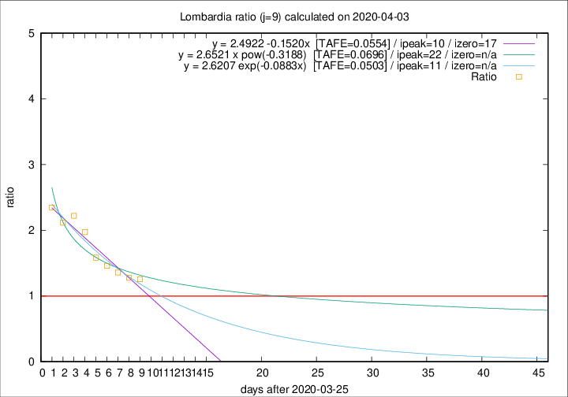

# Lombardia

Data source: https://raw.githubusercontent.com/pcm-dpc/COVID-19/master/dati-json/dpc-covid19-ita-regioni.json

Delta days analysis (j): 9

Analyses for other values of j for 2020-04-03 are avalable [here](../README.md)

Analyses for Lombardia for previous dates are avalable [here](../../README.md)

## Fitting 
|fit type|best fit equation|tafe|tfe|ipeak|izero|
|-------|-----|--------|------|---|---|
|linear|y = 2.4922 -0.1520x  [TAFE=0.0554]|0.0554|0.0028|10|17|
|exp|y = 2.6207 exp(-0.0883x)  [TAFE=0.0503]|0.0503|0.0016|11|n/a|
|pow|y = 2.6521 x pow(-0.3188)  [TAFE=0.0696]|0.0696|0.0041|22|n/a|

## Data
|Date|Daily deaths|Cumulated deaths|Deaths in the last 9 days|Deaths in the 9 days before|ratio|
|----|----------|-----------|-------|--------------------|-----|
|2020-04-03|351|8311|3837|3054|1.2564|
|2020-04-02|367|7960|3782|2960|1.2777|
|2020-04-01|394|7593|3817|2810|1.3584|
|2020-03-31|381|7199|3743|2566|1.4587|
|2020-03-30|458|6818|3723|2351|1.5836|
|2020-03-29|416|6360|3811|1932|1.9726|
|2020-03-28|542|5944|3776|1700|2.2212|
|2020-03-27|541|5402|3443|1626|2.1175|
|2020-03-26|387|4861|3221|1373|2.3460|

[Download data as CSV](COVID-19_lombardia_j9_2020-04-03.csv)

Generated April 12th, 2020 at 16:28:18 UTC+0200 with https://github.com/robianc/COVID-19
