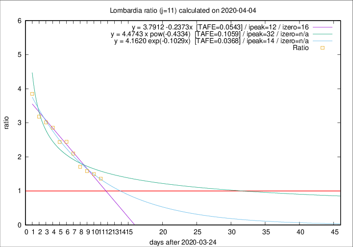

# Lombardia

Data source: https://raw.githubusercontent.com/pcm-dpc/COVID-19/master/dati-json/dpc-covid19-ita-regioni.json

Delta days analysis (j): 11

Analyses for other values of j for 2020-04-04 are avalable [here](../2020-04-04/README.md)

Analyses for Lombardia for previous dates are avalable [here](../README.md)

## Fitting 
|fit type|best fit equation|tafe|tfe|ipeak|izero|
|-------|-----|--------|------|---|---|
|linear|y = 3.7912 -0.2373x  [TAFE=0.0543]|0.0543|-0.0003|12|16|
|exp|y = 4.1620 exp(-0.1029x)  [TAFE=0.0368]|0.0368|0.0008|14|n/a|
|pow|y = 4.4743 x pow(-0.4334)  [TAFE=0.1059]|0.1059|0.0064|32|n/a|

## Data
|Date|Daily deaths|Cumulated deaths|Deaths in the last 11 days|Deaths in the 11 days before|ratio|
|----|----------|-----------|-------|--------------------|-----|
|2020-04-04|345|8656|4478|3288|1.3619|
|2020-04-03|351|8311|4535|3032|1.4957|
|2020-04-02|367|7960|4504|2839|1.5865|
|2020-04-01|394|7593|4498|2627|1.7122|
|2020-03-31|381|7199|4650|2216|2.0984|
|2020-03-30|458|6818|4650|1901|2.4461|
|2020-03-29|416|6360|4401|1805|2.4382|
|2020-03-28|542|5944|4304|1505|2.8598|
|2020-03-27|541|5402|3982|1322|3.0121|
|2020-03-26|387|4861|3643|1145|3.1817|
|2020-03-25|296|4474|3508|911|3.8507|

[Download data as CSV](COVID-19_lombardia_j11_2020-04-04.csv)

Generated April 19th, 2020 at 18:42:39 UTC+0200 with https://github.com/robianc/COVID-19
