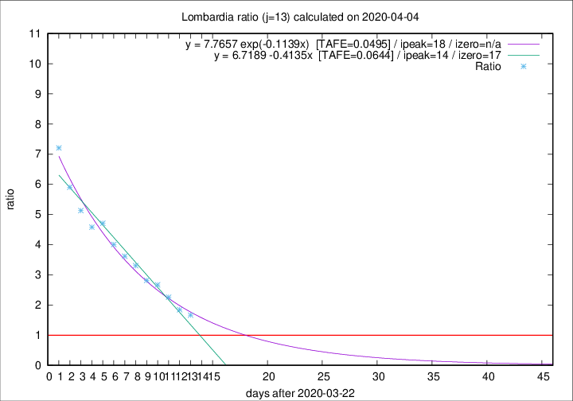

# Lombardia

Data source: https://raw.githubusercontent.com/pcm-dpc/COVID-19/master/dati-json/dpc-covid19-ita-regioni.json

Delta days analysis (j): 13

Analyses for other values of j for 2020-04-04 are avalable [here](../2020-04-04/README.md)

Analyses for Lombardia for previous dates are avalable [here](../README.md)

## Fitting 
|fit type|best fit equation|tafe|tfe|ipeak|izero|
|-------|-----|--------|------|---|---|
|linear|y = 6.7189 -0.4135x  [TAFE=0.0644]|0.0644|-0.0051|14|17|
|exp|y = 7.7657 exp(-0.1139x)  [TAFE=0.0495]|0.0495|0.0016|18|n/a|

## Data
|Date|Daily deaths|Cumulated deaths|Deaths in the last 13 days|Deaths in the 13 days before|ratio|
|----|----------|-----------|-------|--------------------|-----|
|2020-04-04|345|8656|5200|3123|1.6651|
|2020-04-03|351|8311|5216|2828|1.8444|
|2020-04-02|367|7960|5411|2395|2.2593|
|2020-04-01|394|7593|5425|2033|2.6685|
|2020-03-31|381|7199|5240|1861|2.8157|
|2020-03-30|458|6818|5178|1567|3.3044|
|2020-03-29|416|6360|4940|1365|3.6190|
|2020-03-28|542|5944|4726|1180|4.0051|
|2020-03-27|541|5402|4436|942|4.7091|
|2020-03-26|387|4861|3971|867|4.5802|
|2020-03-25|296|4474|3730|727|5.1307|
|2020-03-24|402|4178|3561|603|5.9055|
|2020-03-23|320|3776|3308|459|7.2070|

[Download data as CSV](COVID-19_lombardia_j13_2020-04-04.csv)

Generated April 14th, 2020 at 19:16:04 UTC+0200 with https://github.com/robianc/COVID-19
