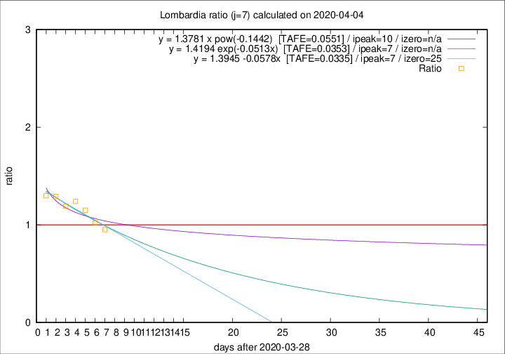

# Lombardia

Data source: https://raw.githubusercontent.com/pcm-dpc/COVID-19/master/dati-json/dpc-covid19-ita-regioni.json

Delta days analysis (j): 7

## Fitting 
|fit type|best fit equation|tafe|tfe|ipeak|izero|
|-------|-----|--------|------|---|---|
|linear|y = 1.3945 -0.0578x  [TAFE=0.0335]|0.0335|0.0018|7|25|
|exp|y = 1.4194 exp(-0.0513x)  [TAFE=0.0353]|0.0353|0.0007|7|n/a|
|pow|y = 1.3781 x pow(-0.1442)  [TAFE=0.0551]|0.0551|0.0018|10|n/a|

## Data
|Date|Daily deaths|Cumulated deaths|Deaths in the last 7 days|Deaths in the 7 days before|ratio|
|----|----------|-----------|-------|--------------------|-----|
|2020-04-04|345|8656|2712|2849|0.9519|
|2020-04-03|351|8311|2909|2853|1.0196|
|2020-04-02|367|7960|3099|2693|1.1508|
|2020-04-01|394|7593|3119|2515|1.2402|
|2020-03-31|381|7199|3021|2538|1.1903|
|2020-03-30|458|6818|3042|2356|1.2912|
|2020-03-29|416|6360|2904|2238|1.2976|

[Download data as CSV](COVID-19_lombardia_j7_2020-04-04.csv)

Generated April 8th, 2020 at 23:43:36 UTC+0200 with https://github.com/robianc/COVID-19
