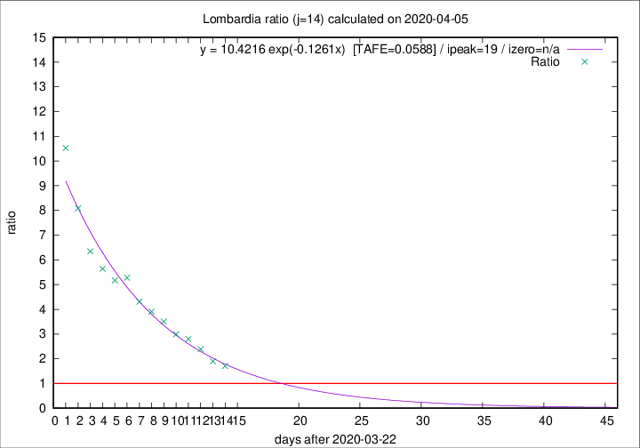

# Lombardia

Data source: https://raw.githubusercontent.com/pcm-dpc/COVID-19/master/dati-json/dpc-covid19-ita-regioni.json

Delta days analysis (j): 14

## Fitting 
|fit type|best fit equation|tafe|tfe|ipeak|izero|
|-------|-----|--------|------|---|---|
|exp|y = 10.4216 exp(-0.1261x)  [TAFE=0.0588]|0.0588|0.0028|19|n/a|

## Data
|Date|Daily deaths|Cumulated deaths|Deaths in the last 14 days|Deaths in the 14 days before|ratio|
|----|----------|-----------|-------|--------------------|-----|
|2020-04-05|249|8905|5449|3189|1.7087|
|2020-04-04|345|8656|5561|2941|1.8909|
|2020-04-03|351|8311|5762|2414|2.3869|
|2020-04-02|367|7960|5792|2070|2.7981|
|2020-04-01|394|7593|5634|1886|2.9873|
|2020-03-31|381|7199|5559|1585|3.5073|
|2020-03-30|458|6818|5398|1382|3.9059|
|2020-03-29|416|6360|5142|1194|4.3065|
|2020-03-28|542|5944|4978|943|5.2789|
|2020-03-27|541|5402|4512|873|5.1684|
|2020-03-26|387|4861|4117|730|5.6397|
|2020-03-25|296|4474|3857|608|6.3438|
|2020-03-24|402|4178|3710|459|8.0828|
|2020-03-23|320|3776|3443|327|10.5291|

[Download data as CSV](COVID-19_lombardia_j14_2020-04-05.csv)

Generated April 8th, 2020 at 23:43:36 UTC+0200 with https://github.com/robianc/COVID-19
