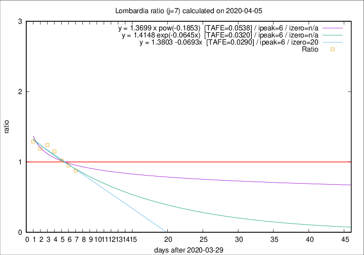

# Lombardia

Data source: https://raw.githubusercontent.com/pcm-dpc/COVID-19/master/dati-json/dpc-covid19-ita-regioni.json

Delta days analysis (j): 7

Analyses for other values of j for 2020-04-05 are avalable [here](../2020-04-05/README.md)

Analyses for Lombardia for previous dates are avalable [here](../README.md)

## Fitting 
|fit type|best fit equation|tafe|tfe|ipeak|izero|
|-------|-----|--------|------|---|---|
|linear|y = 1.3803 -0.0693x  [TAFE=0.0290]|0.0290|0.0016|6|20|
|exp|y = 1.4148 exp(-0.0645x)  [TAFE=0.0320]|0.0320|0.0006|6|n/a|
|pow|y = 1.3699 x pow(-0.1853)  [TAFE=0.0538]|0.0538|0.0021|6|n/a|

## Data
|Date|Daily deaths|Cumulated deaths|Deaths in the last 7 days|Deaths in the 7 days before|ratio|
|----|----------|-----------|-------|--------------------|-----|
|2020-04-05|249|8905|2545|2904|0.8764|
|2020-04-04|345|8656|2712|2849|0.9519|
|2020-04-03|351|8311|2909|2853|1.0196|
|2020-04-02|367|7960|3099|2693|1.1508|
|2020-04-01|394|7593|3119|2515|1.2402|
|2020-03-31|381|7199|3021|2538|1.1903|
|2020-03-30|458|6818|3042|2356|1.2912|

[Download data as CSV](COVID-19_lombardia_j7_2020-04-05.csv)

Generated April 12th, 2020 at 17:02:01 UTC+0200 with https://github.com/robianc/COVID-19
