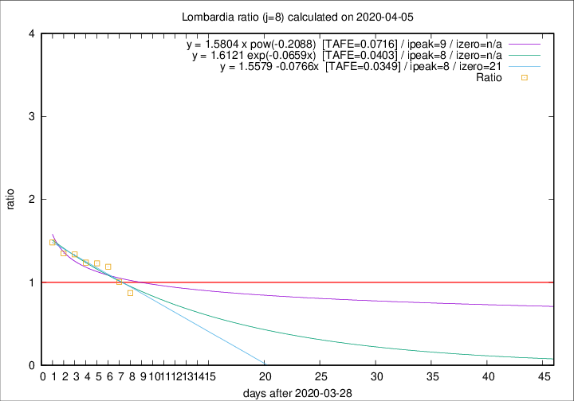

# Lombardia

Data source: https://raw.githubusercontent.com/pcm-dpc/COVID-19/master/dati-json/dpc-covid19-ita-regioni.json

Delta days analysis (j): 8

Analyses for other values of j for 2020-04-05 are avalable [here](../2020-04-05/README.md)

Analyses for Lombardia for previous dates are avalable [here](../README.md)

## Fitting 
|fit type|best fit equation|tafe|tfe|ipeak|izero|
|-------|-----|--------|------|---|---|
|linear|y = 1.5579 -0.0766x  [TAFE=0.0349]|0.0349|0.0028|8|21|
|exp|y = 1.6121 exp(-0.0659x)  [TAFE=0.0403]|0.0403|0.0015|8|n/a|
|pow|y = 1.5804 x pow(-0.2088)  [TAFE=0.0716]|0.0716|0.0034|9|n/a|

## Data
|Date|Daily deaths|Cumulated deaths|Deaths in the last 8 days|Deaths in the 8 days before|ratio|
|----|----------|-----------|-------|--------------------|-----|
|2020-04-05|249|8905|2961|3395|0.8722|
|2020-04-04|345|8656|3254|3234|1.0062|
|2020-04-03|351|8311|3450|2902|1.1888|
|2020-04-02|367|7960|3486|2834|1.2301|
|2020-04-01|394|7593|3415|2758|1.2382|
|2020-03-31|381|7199|3423|2558|1.3382|
|2020-03-30|458|6818|3362|2490|1.3502|
|2020-03-29|416|6360|3265|2205|1.4807|

[Download data as CSV](COVID-19_lombardia_j8_2020-04-05.csv)

Generated April 14th, 2020 at 19:16:04 UTC+0200 with https://github.com/robianc/COVID-19
