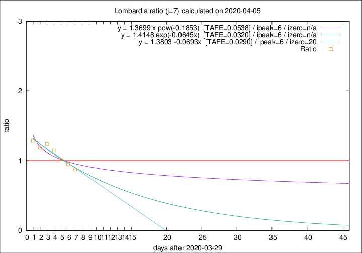

# Lombardia

Data source: https://raw.githubusercontent.com/pcm-dpc/COVID-19/master/dati-json/dpc-covid19-ita-regioni.json

Estimates in this page were made on 12/4/2020 with data available until 05/04/2020.

## Summary 

### Peak estimate 
|j|linear [TAFE]|exponential [TAFE]|power law [TAFE]|details|
|---|----|-----------|---------|-------|
|7|5/4/2020 [TAFE=0.0290]|5/4/2020 [TAFE=0.0320]|5/4/2020 [TAFE=0.0538]|[analysis](COVID-19_lombardia_j7_2020-04-05.md)|
|8|6/4/2020 [TAFE=0.0349]|6/4/2020 [TAFE=0.0403]|7/4/2020 [TAFE=0.0716]|[analysis](COVID-19_lombardia_j8_2020-04-05.md)|
|9|6/4/2020 [TAFE=0.0759]|7/4/2020 [TAFE=0.0540]|10/4/2020 [TAFE=0.0327]|[analysis](COVID-19_lombardia_j9_2020-04-05.md)|
|10|7/4/2020 [TAFE=0.0611]|8/4/2020 [TAFE=0.0426]|16/4/2020 [TAFE=0.0664]|[analysis](COVID-19_lombardia_j10_2020-04-05.md)|
|11|7/4/2020 [TAFE=0.0504]|9/4/2020 [TAFE=0.0344]|23/4/2020 [TAFE=0.1045]|[analysis](COVID-19_lombardia_j11_2020-04-05.md)|
|12|7/4/2020 [TAFE=0.0496]|9/4/2020 [TAFE=0.0380]|1/5/2020 [TAFE=0.1427]|[analysis](COVID-19_lombardia_j12_2020-04-05.md)|
|13|7/4/2020 [TAFE=0.0513]|11/4/2020 [TAFE=0.0479]|12/5/2020 [TAFE=0.1571]|[analysis](COVID-19_lombardia_j13_2020-04-05.md)|
|14|6/4/2020 [TAFE=0.1389]|11/4/2020 [TAFE=0.0588]|14/5/2020 [TAFE=0.1341]|[analysis](COVID-19_lombardia_j14_2020-04-05.md)|

Best estimator is linear with j=7 (TAFE=0.0290)
Corresponding peak date estimate is 5/4/2020 (ipeak 6)

Peak date range estimate: 5/4/2020 - 21/5/2020

### End estimate 
|j|linear [TAFE/TFE]|exponential [TAFE/TFE]|power law [TAFE/TFE]|details|
|---|----|-----------|---------|-------|
|7|19/4/2020 [TAFE=0.0290]|-|-|[analysis](COVID-19_lombardia_j7_2020-04-05.md)|
|8|-|-|-|[analysis](COVID-19_lombardia_j8_2020-04-05.md)|
|9|-|-|-|[analysis](COVID-19_lombardia_j9_2020-04-05.md)|
|10|-|-|-|[analysis](COVID-19_lombardia_j10_2020-04-05.md)|
|11|-|-|-|[analysis](COVID-19_lombardia_j11_2020-04-05.md)|
|12|-|-|-|[analysis](COVID-19_lombardia_j12_2020-04-05.md)|
|13|-|-|-|[analysis](COVID-19_lombardia_j13_2020-04-05.md)|
|14|-|-|-|[analysis](COVID-19_lombardia_j14_2020-04-05.md)|

Best estimator is linear with j=7 (TAFE=0.0290)
Corresponding end date estimate is 19/4/2020 (izero 20)

End date range estimate: 30/3/2020 - 20/4/2020

Generated April 12th, 2020 at 17:02:01 UTC+0200 with https://github.com/robianc/COVID-19
