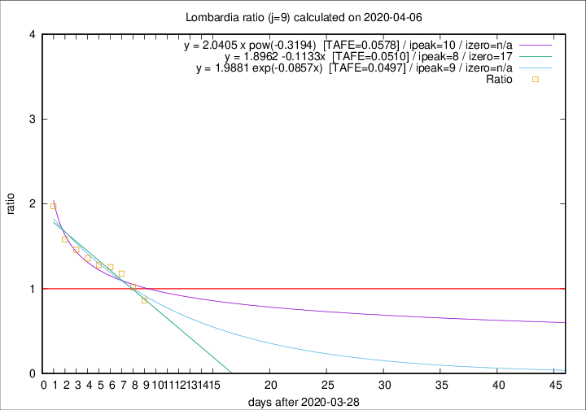

# Lombardia

Data source: https://raw.githubusercontent.com/pcm-dpc/COVID-19/master/dati-json/dpc-covid19-ita-regioni.json

Delta days analysis (j): 9

Analyses for other values of j for 2020-04-06 are avalable [here](../README.md)

Analyses for Lombardia for previous dates are avalable [here](../../README.md)

## Fitting 
|fit type|best fit equation|tafe|tfe|ipeak|izero|
|-------|-----|--------|------|---|---|
|linear|y = 1.8962 -0.1133x  [TAFE=0.0510]|0.0510|0.0024|8|17|
|exp|y = 1.9881 exp(-0.0857x)  [TAFE=0.0497]|0.0497|0.0013|9|n/a|
|pow|y = 2.0405 x pow(-0.3194)  [TAFE=0.0578]|0.0578|0.0026|10|n/a|

## Data
|Date|Daily deaths|Cumulated deaths|Deaths in the last 9 days|Deaths in the 9 days before|ratio|
|----|----------|-----------|-------|--------------------|-----|
|2020-04-06|297|9202|3258|3776|0.8628|
|2020-04-05|249|8905|3503|3443|1.0174|
|2020-04-04|345|8656|3795|3221|1.1782|
|2020-04-03|351|8311|3837|3054|1.2564|
|2020-04-02|367|7960|3782|2960|1.2777|
|2020-04-01|394|7593|3817|2810|1.3584|
|2020-03-31|381|7199|3743|2566|1.4587|
|2020-03-30|458|6818|3723|2351|1.5836|
|2020-03-29|416|6360|3811|1932|1.9726|

[Download data as CSV](COVID-19_lombardia_j9_2020-04-06.csv)

Generated April 12th, 2020 at 16:28:18 UTC+0200 with https://github.com/robianc/COVID-19
