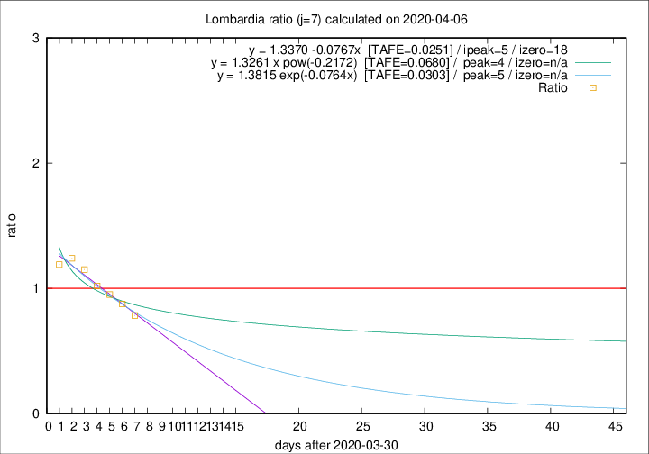

# Lombardia

Data source: https://raw.githubusercontent.com/pcm-dpc/COVID-19/master/dati-json/dpc-covid19-ita-regioni.json

Estimates in this page were made on 9/4/2020 with data available until 06/04/2020.

## Summary 

### Peak estimate 
|j|linear [TAFE]|exponential [TAFE]|power law [TAFE]|details|
|---|----|-----------|---------|-------|
|7|5/4/2020 [TAFE=0.0251]|5/4/2020 [TAFE=0.0303]|4/4/2020 [TAFE=0.0680]|[analysis](COVID-19_lombardia_j7_2020-04-06.md)|
|8|6/4/2020 [TAFE=0.0351]|6/4/2020 [TAFE=0.0381]|6/4/2020 [TAFE=0.0790]|[analysis](COVID-19_lombardia_j8_2020-04-06.md)|
|9|6/4/2020 [TAFE=0.0510]|7/4/2020 [TAFE=0.0497]|8/4/2020 [TAFE=0.0578]|[analysis](COVID-19_lombardia_j9_2020-04-06.md)|
|10|7/4/2020 [TAFE=0.0671]|8/4/2020 [TAFE=0.0414]|12/4/2020 [TAFE=0.0644]|[analysis](COVID-19_lombardia_j10_2020-04-06.md)|
|11|7/4/2020 [TAFE=0.0658]|9/4/2020 [TAFE=0.0369]|18/4/2020 [TAFE=0.0807]|[analysis](COVID-19_lombardia_j11_2020-04-06.md)|
|12|8/4/2020 [TAFE=0.0683]|9/4/2020 [TAFE=0.0310]|23/4/2020 [TAFE=0.1140]|[analysis](COVID-19_lombardia_j12_2020-04-06.md)|
|13|8/4/2020 [TAFE=0.0623]|10/4/2020 [TAFE=0.0445]|3/5/2020 [TAFE=0.1667]|[analysis](COVID-19_lombardia_j13_2020-04-06.md)|
|14|8/4/2020 [TAFE=0.0839]|11/4/2020 [TAFE=0.0518]|11/5/2020 [TAFE=0.1680]|[analysis](COVID-19_lombardia_j14_2020-04-06.md)|

Best estimator is linear with j=7 (TAFE=0.0251)
Corresponding peak date estimate is 5/4/2020 (ipeak 5)

Peak date range estimate: 4/4/2020 - 18/5/2020

### End estimate 
|j|linear [TAFE/TFE]|exponential [TAFE/TFE]|power law [TAFE/TFE]|details|
|---|----|-----------|---------|-------|
|7|18/4/2020 [TAFE=0.0251]|-|-|[analysis](COVID-19_lombardia_j7_2020-04-06.md)|
|8|-|-|-|[analysis](COVID-19_lombardia_j8_2020-04-06.md)|
|9|-|-|-|[analysis](COVID-19_lombardia_j9_2020-04-06.md)|
|10|-|-|-|[analysis](COVID-19_lombardia_j10_2020-04-06.md)|
|11|-|-|-|[analysis](COVID-19_lombardia_j11_2020-04-06.md)|
|12|-|-|-|[analysis](COVID-19_lombardia_j12_2020-04-06.md)|
|13|-|-|-|[analysis](COVID-19_lombardia_j13_2020-04-06.md)|
|14|-|-|-|[analysis](COVID-19_lombardia_j14_2020-04-06.md)|

Best estimator is linear with j=7 (TAFE=0.0251)
Corresponding end date estimate is 18/4/2020 (izero 18)

End date range estimate: 31/3/2020 - 20/4/2020

Generated April 9th, 2020 at 16:40:48 UTC+0200 with https://github.com/robianc/COVID-19
