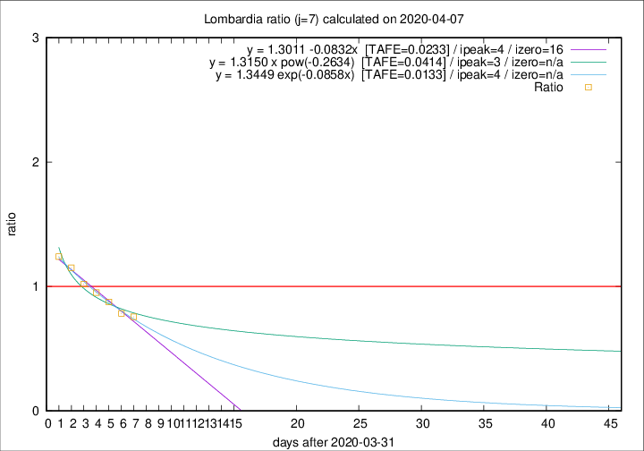

# Lombardia

Data source: https://raw.githubusercontent.com/pcm-dpc/COVID-19/master/dati-json/dpc-covid19-ita-regioni.json

Delta days analysis (j): 7

## Fitting 
|fit type|best fit equation|tafe|tfe|ipeak|izero|
|-------|-----|--------|------|---|---|
|linear|y = 1.3011 -0.0832x  [TAFE=0.0233]|0.0233|-0.0000|4|16|
|exp|y = 1.3449 exp(-0.0858x)  [TAFE=0.0133]|0.0133|0.0003|4|n/a|
|pow|y = 1.3150 x pow(-0.2634)  [TAFE=0.0414]|0.0414|0.0010|3|n/a|

## Data
|Date|Daily deaths|Cumulated deaths|Deaths in the last 7 days|Deaths in the 7 days before|ratio|
|----|----------|-----------|-------|--------------------|-----|
|2020-04-07|282|9484|2285|3021|0.7564|
|2020-04-06|297|9202|2384|3042|0.7837|
|2020-04-05|249|8905|2545|2904|0.8764|
|2020-04-04|345|8656|2712|2849|0.9519|
|2020-04-03|351|8311|2909|2853|1.0196|
|2020-04-02|367|7960|3099|2693|1.1508|
|2020-04-01|394|7593|3119|2515|1.2402|

[Download data as CSV](COVID-19_lombardia_j7_2020-04-07.csv)

Generated April 8th, 2020 at 23:43:36 UTC+0200 with https://github.com/robianc/COVID-19
