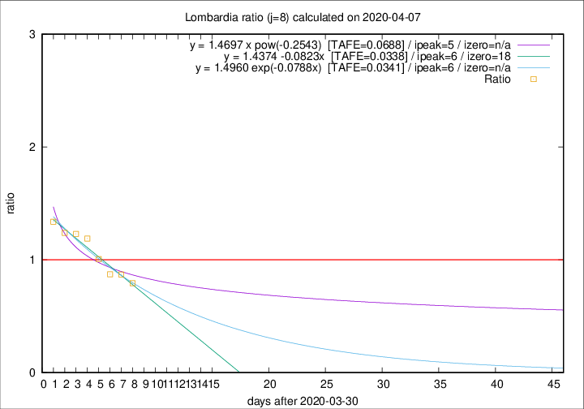

# Lombardia

Data source: https://raw.githubusercontent.com/pcm-dpc/COVID-19/master/dati-json/dpc-covid19-ita-regioni.json

Delta days analysis (j): 8

Analyses for other values of j for 2020-04-07 are avalable [here](../2020-04-07/README.md)

Analyses for Lombardia for previous dates are avalable [here](../README.md)

## Fitting 
|fit type|best fit equation|tafe|tfe|ipeak|izero|
|-------|-----|--------|------|---|---|
|linear|y = 1.4374 -0.0823x  [TAFE=0.0338]|0.0338|0.0017|6|18|
|exp|y = 1.4960 exp(-0.0788x)  [TAFE=0.0341]|0.0341|0.0012|6|n/a|
|pow|y = 1.4697 x pow(-0.2543)  [TAFE=0.0688]|0.0688|0.0033|5|n/a|

## Data
|Date|Daily deaths|Cumulated deaths|Deaths in the last 8 days|Deaths in the 8 days before|ratio|
|----|----------|-----------|-------|--------------------|-----|
|2020-04-07|282|9484|2666|3362|0.7930|
|2020-04-06|297|9202|2842|3265|0.8704|
|2020-04-05|249|8905|2961|3395|0.8722|
|2020-04-04|345|8656|3254|3234|1.0062|
|2020-04-03|351|8311|3450|2902|1.1888|
|2020-04-02|367|7960|3486|2834|1.2301|
|2020-04-01|394|7593|3415|2758|1.2382|
|2020-03-31|381|7199|3423|2558|1.3382|

[Download data as CSV](COVID-19_lombardia_j8_2020-04-07.csv)

Generated April 19th, 2020 at 18:42:39 UTC+0200 with https://github.com/robianc/COVID-19
