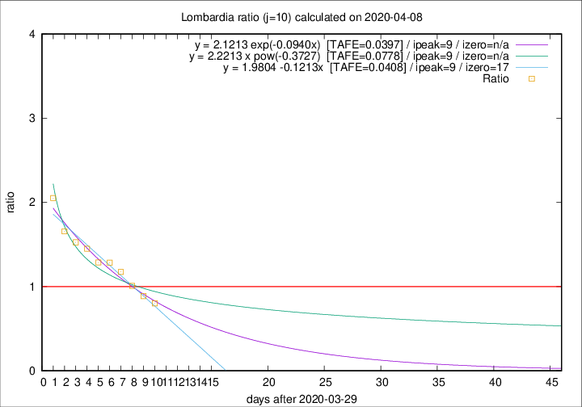

# Lombardia

Data source: https://raw.githubusercontent.com/pcm-dpc/COVID-19/master/dati-json/dpc-covid19-ita-regioni.json

Delta days analysis (j): 10

Analyses for other values of j for 2020-04-08 are avalable [here](../2020-04-08/README.md)

Analyses for Lombardia for previous dates are avalable [here](../README.md)

## Fitting 
|fit type|best fit equation|tafe|tfe|ipeak|izero|
|-------|-----|--------|------|---|---|
|linear|y = 1.9804 -0.1213x  [TAFE=0.0408]|0.0408|0.0009|9|17|
|exp|y = 2.1213 exp(-0.0940x)  [TAFE=0.0397]|0.0397|0.0009|9|n/a|
|pow|y = 2.2213 x pow(-0.3727)  [TAFE=0.0778]|0.0778|0.0039|9|n/a|

## Data
|Date|Daily deaths|Cumulated deaths|Deaths in the last 10 days|Deaths in the 10 days before|ratio|
|----|----------|-----------|-------|--------------------|-----|
|2020-04-08|238|9722|3362|4192|0.8020|
|2020-04-07|282|9484|3540|3985|0.8883|
|2020-04-06|297|9202|3800|3762|1.0101|
|2020-04-05|249|8905|4044|3441|1.1752|
|2020-04-04|345|8656|4182|3256|1.2844|
|2020-04-03|351|8311|4133|3212|1.2867|
|2020-04-02|367|7960|4184|2886|1.4498|
|2020-04-01|394|7593|4137|2712|1.5254|
|2020-03-31|381|7199|4104|2478|1.6562|
|2020-03-30|458|6818|4269|2081|2.0514|

[Download data as CSV](COVID-19_lombardia_j10_2020-04-08.csv)

Generated April 14th, 2020 at 19:16:04 UTC+0200 with https://github.com/robianc/COVID-19
