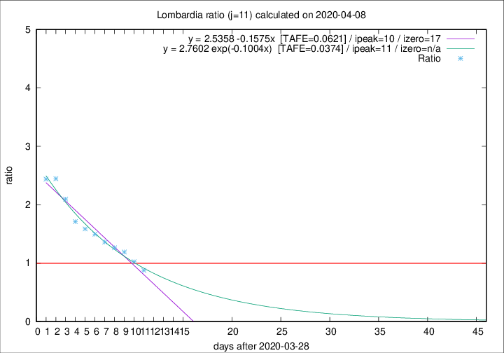

# Lombardia

Data source: https://raw.githubusercontent.com/pcm-dpc/COVID-19/master/dati-json/dpc-covid19-ita-regioni.json

Delta days analysis (j): 11

## Fitting 
|fit type|best fit equation|tafe|tfe|ipeak|izero|
|-------|-----|--------|------|---|---|
|linear|y = 2.5358 -0.1575x  [TAFE=0.0621]|0.0621|-0.0001|10|17|
|exp|y = 2.7602 exp(-0.1004x)  [TAFE=0.0374]|0.0374|0.0011|11|n/a|

## Data
|Date|Daily deaths|Cumulated deaths|Deaths in the last 11 days|Deaths in the 11 days before|ratio|
|----|----------|-----------|-------|--------------------|-----|
|2020-04-08|238|9722|3778|4304|0.8778|
|2020-04-07|282|9484|4082|3982|1.0251|
|2020-04-06|297|9202|4341|3643|1.1916|
|2020-04-05|249|8905|4431|3508|1.2631|
|2020-04-04|345|8656|4478|3288|1.3619|
|2020-04-03|351|8311|4535|3032|1.4957|
|2020-04-02|367|7960|4504|2839|1.5865|
|2020-04-01|394|7593|4498|2627|1.7122|
|2020-03-31|381|7199|4650|2216|2.0984|
|2020-03-30|458|6818|4650|1901|2.4461|
|2020-03-29|416|6360|4401|1805|2.4382|

[Download data as CSV](COVID-19_lombardia_j11_2020-04-08.csv)

Generated April 8th, 2020 at 23:43:36 UTC+0200 with https://github.com/robianc/COVID-19
