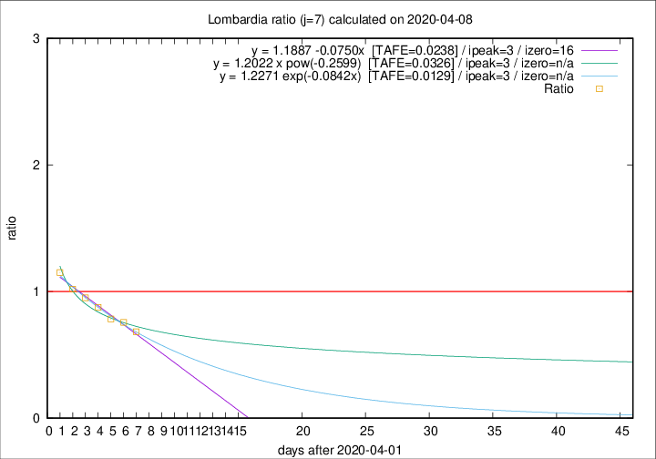

# Lombardia

Data source: https://raw.githubusercontent.com/pcm-dpc/COVID-19/master/dati-json/dpc-covid19-ita-regioni.json

Delta days analysis (j): 7

Analyses for other values of j for 2020-04-08 are avalable [here](../2020-04-08/README.md)

Analyses for Lombardia for previous dates are avalable [here](../README.md)

## Fitting 
|fit type|best fit equation|tafe|tfe|ipeak|izero|
|-------|-----|--------|------|---|---|
|linear|y = 1.1887 -0.0750x  [TAFE=0.0238]|0.0238|0.0000|3|16|
|exp|y = 1.2271 exp(-0.0842x)  [TAFE=0.0129]|0.0129|0.0003|3|n/a|
|pow|y = 1.2022 x pow(-0.2599)  [TAFE=0.0326]|0.0326|0.0007|3|n/a|

## Data
|Date|Daily deaths|Cumulated deaths|Deaths in the last 7 days|Deaths in the 7 days before|ratio|
|----|----------|-----------|-------|--------------------|-----|
|2020-04-08|238|9722|2129|3119|0.6826|
|2020-04-07|282|9484|2285|3021|0.7564|
|2020-04-06|297|9202|2384|3042|0.7837|
|2020-04-05|249|8905|2545|2904|0.8764|
|2020-04-04|345|8656|2712|2849|0.9519|
|2020-04-03|351|8311|2909|2853|1.0196|
|2020-04-02|367|7960|3099|2693|1.1508|

[Download data as CSV](COVID-19_lombardia_j7_2020-04-08.csv)

Generated April 16th, 2020 at 20:09:19 UTC+0200 with https://github.com/robianc/COVID-19
