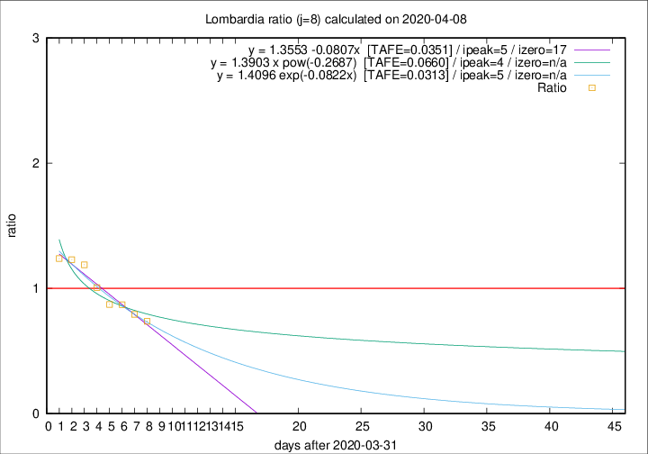

# Lombardia

Data source: https://raw.githubusercontent.com/pcm-dpc/COVID-19/master/dati-json/dpc-covid19-ita-regioni.json

Delta days analysis (j): 8

## Fitting 
|fit type|best fit equation|tafe|tfe|ipeak|izero|
|-------|-----|--------|------|---|---|
|linear|y = 1.3553 -0.0807x  [TAFE=0.0351]|0.0351|0.0018|5|17|
|exp|y = 1.4096 exp(-0.0822x)  [TAFE=0.0313]|0.0313|0.0009|5|n/a|
|pow|y = 1.3903 x pow(-0.2687)  [TAFE=0.0660]|0.0660|0.0029|4|n/a|

## Data
|Date|Daily deaths|Cumulated deaths|Deaths in the last 8 days|Deaths in the 8 days before|ratio|
|----|----------|-----------|-------|--------------------|-----|
|2020-04-08|238|9722|2523|3423|0.7371|
|2020-04-07|282|9484|2666|3362|0.7930|
|2020-04-06|297|9202|2842|3265|0.8704|
|2020-04-05|249|8905|2961|3395|0.8722|
|2020-04-04|345|8656|3254|3234|1.0062|
|2020-04-03|351|8311|3450|2902|1.1888|
|2020-04-02|367|7960|3486|2834|1.2301|
|2020-04-01|394|7593|3415|2758|1.2382|

[Download data as CSV](COVID-19_lombardia_j8_2020-04-08.csv)

Generated April 8th, 2020 at 23:43:36 UTC+0200 with https://github.com/robianc/COVID-19
