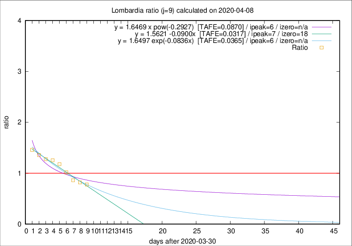

# Lombardia

Data source: https://raw.githubusercontent.com/pcm-dpc/COVID-19/master/dati-json/dpc-covid19-ita-regioni.json

Delta days analysis (j): 9

Analyses for other values of j for 2020-04-08 are avalable [here](../2020-04-08/README.md)

Analyses for Lombardia for previous dates are avalable [here](../README.md)

## Fitting 
|fit type|best fit equation|tafe|tfe|ipeak|izero|
|-------|-----|--------|------|---|---|
|linear|y = 1.5621 -0.0900x  [TAFE=0.0317]|0.0317|0.0017|7|18|
|exp|y = 1.6497 exp(-0.0836x)  [TAFE=0.0365]|0.0365|0.0010|6|n/a|
|pow|y = 1.6469 x pow(-0.2927)  [TAFE=0.0870]|0.0870|0.0045|6|n/a|

## Data
|Date|Daily deaths|Cumulated deaths|Deaths in the last 9 days|Deaths in the 9 days before|ratio|
|----|----------|-----------|-------|--------------------|-----|
|2020-04-08|238|9722|2904|3723|0.7800|
|2020-04-07|282|9484|3124|3811|0.8197|
|2020-04-06|297|9202|3258|3776|0.8628|
|2020-04-05|249|8905|3503|3443|1.0174|
|2020-04-04|345|8656|3795|3221|1.1782|
|2020-04-03|351|8311|3837|3054|1.2564|
|2020-04-02|367|7960|3782|2960|1.2777|
|2020-04-01|394|7593|3817|2810|1.3584|
|2020-03-31|381|7199|3743|2566|1.4587|

[Download data as CSV](COVID-19_lombardia_j9_2020-04-08.csv)

Generated April 19th, 2020 at 18:42:39 UTC+0200 with https://github.com/robianc/COVID-19
