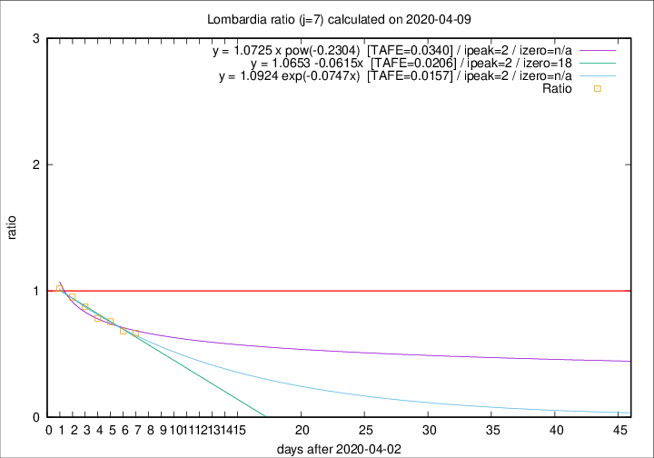

# Lombardia

Data source: https://raw.githubusercontent.com/pcm-dpc/COVID-19/master/dati-json/dpc-covid19-ita-regioni.json

Estimates in this page were made on 19/4/2020 with data available until 09/04/2020.

## Summary 

### Peak estimate 
|j|linear [TAFE]|exponential [TAFE]|power law [TAFE]|details|
|---|----|-----------|---------|-------|
|7|5/4/2020 [TAFE=0.0206]|5/4/2020 [TAFE=0.0157]|5/4/2020 [TAFE=0.0340]|[analysis](COVID-19_lombardia_j7_2020-04-09.md)|
|8|6/4/2020 [TAFE=0.0443]|6/4/2020 [TAFE=0.0303]|5/4/2020 [TAFE=0.0409]|[analysis](COVID-19_lombardia_j8_2020-04-09.md)|
|9|7/4/2020 [TAFE=0.0404]|7/4/2020 [TAFE=0.0385]|6/4/2020 [TAFE=0.0770]|[analysis](COVID-19_lombardia_j9_2020-04-09.md)|
|10|8/4/2020 [TAFE=0.0267]|7/4/2020 [TAFE=0.0327]|7/4/2020 [TAFE=0.0957]|[analysis](COVID-19_lombardia_j10_2020-04-09.md)|
|11|9/4/2020 [TAFE=0.0636]|9/4/2020 [TAFE=0.0360]|10/4/2020 [TAFE=0.0777]|[analysis](COVID-19_lombardia_j11_2020-04-09.md)|
|12|9/4/2020 [TAFE=0.0815]|10/4/2020 [TAFE=0.0346]|13/4/2020 [TAFE=0.0889]|[analysis](COVID-19_lombardia_j12_2020-04-09.md)|
|13|9/4/2020 [TAFE=0.1089]|11/4/2020 [TAFE=0.0370]|18/4/2020 [TAFE=0.1047]|[analysis](COVID-19_lombardia_j13_2020-04-09.md)|
|14|10/4/2020 [TAFE=0.1239]|12/4/2020 [TAFE=0.0467]|24/4/2020 [TAFE=0.1557]|[analysis](COVID-19_lombardia_j14_2020-04-09.md)|

Best estimator is exp with j=7 (TAFE=0.0157)
Corresponding peak date estimate is 5/4/2020 (ipeak 2)

Peak date range estimate: 5/4/2020 - 1/5/2020

### End estimate 
|j|linear [TAFE/TFE]|exponential [TAFE/TFE]|power law [TAFE/TFE]|details|
|---|----|-----------|---------|-------|
|7|21/4/2020 [TAFE=0.0206]|-|-|[analysis](COVID-19_lombardia_j7_2020-04-09.md)|
|8|-|-|-|[analysis](COVID-19_lombardia_j8_2020-04-09.md)|
|9|-|-|-|[analysis](COVID-19_lombardia_j9_2020-04-09.md)|
|10|-|-|-|[analysis](COVID-19_lombardia_j10_2020-04-09.md)|
|11|-|-|-|[analysis](COVID-19_lombardia_j11_2020-04-09.md)|
|12|-|-|-|[analysis](COVID-19_lombardia_j12_2020-04-09.md)|
|13|-|-|-|[analysis](COVID-19_lombardia_j13_2020-04-09.md)|
|14|-|-|-|[analysis](COVID-19_lombardia_j14_2020-04-09.md)|

Best estimator is linear with j=7 (TAFE=0.0206)
Corresponding end date estimate is 21/4/2020 (izero 18)

End date range estimate: 3/4/2020 - 21/4/2020

Generated April 19th, 2020 at 18:42:39 UTC+0200 with https://github.com/robianc/COVID-19
