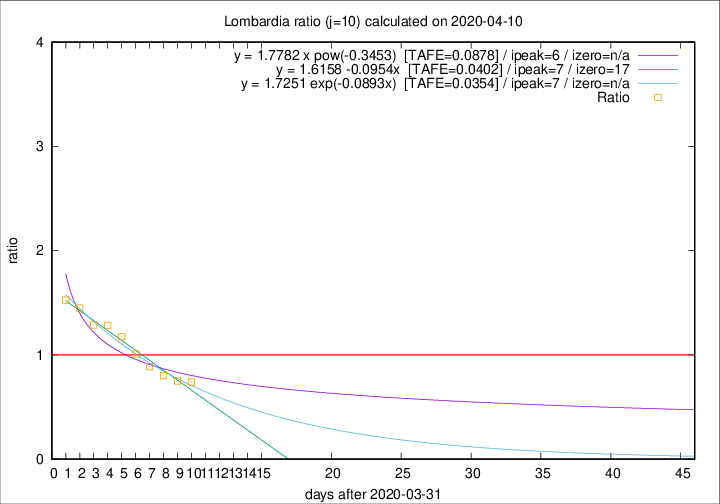

# Lombardia

Data source: https://raw.githubusercontent.com/pcm-dpc/COVID-19/master/dati-json/dpc-covid19-ita-regioni.json

Delta days analysis (j): 10

Analyses for other values of j for 2020-04-10 are avalable [here](../2020-04-10/README.md)

Analyses for Lombardia for previous dates are avalable [here](../README.md)

## Fitting 
|fit type|best fit equation|tafe|tfe|ipeak|izero|
|-------|-----|--------|------|---|---|
|linear|y = 1.6158 -0.0954x  [TAFE=0.0402]|0.0402|0.0009|7|17|
|exp|y = 1.7251 exp(-0.0893x)  [TAFE=0.0354]|0.0354|0.0009|7|n/a|
|pow|y = 1.7782 x pow(-0.3453)  [TAFE=0.0878]|0.0878|0.0048|6|n/a|

## Data
|Date|Daily deaths|Cumulated deaths|Deaths in the last 10 days|Deaths in the 10 days before|ratio|
|----|----------|-----------|-------|--------------------|-----|
|2020-04-10|216|10238|3039|4104|0.7405|
|2020-04-09|300|10022|3204|4269|0.7505|
|2020-04-08|238|9722|3362|4192|0.8020|
|2020-04-07|282|9484|3540|3985|0.8883|
|2020-04-06|297|9202|3800|3762|1.0101|
|2020-04-05|249|8905|4044|3441|1.1752|
|2020-04-04|345|8656|4182|3256|1.2844|
|2020-04-03|351|8311|4133|3212|1.2867|
|2020-04-02|367|7960|4184|2886|1.4498|
|2020-04-01|394|7593|4137|2712|1.5254|

[Download data as CSV](COVID-19_lombardia_j10_2020-04-10.csv)

Generated April 12th, 2020 at 17:02:01 UTC+0200 with https://github.com/robianc/COVID-19
