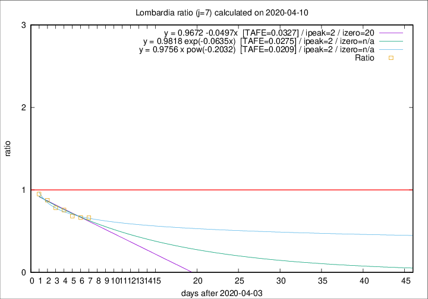

# Lombardia

Data source: https://raw.githubusercontent.com/pcm-dpc/COVID-19/master/dati-json/dpc-covid19-ita-regioni.json

Estimates in this page were made on 19/4/2020 with data available until 10/04/2020.

## Summary 

### Peak estimate 
|j|linear [TAFE]|exponential [TAFE]|power law [TAFE]|details|
|---|----|-----------|---------|-------|
|7|6/4/2020 [TAFE=0.0327]|6/4/2020 [TAFE=0.0275]|6/4/2020 [TAFE=0.0209]|[analysis](COVID-19_lombardia_j7_2020-04-10.md)|
|8|6/4/2020 [TAFE=0.0456]|6/4/2020 [TAFE=0.0315]|5/4/2020 [TAFE=0.0214]|[analysis](COVID-19_lombardia_j8_2020-04-10.md)|
|9|7/4/2020 [TAFE=0.0506]|7/4/2020 [TAFE=0.0385]|6/4/2020 [TAFE=0.0602]|[analysis](COVID-19_lombardia_j9_2020-04-10.md)|
|10|8/4/2020 [TAFE=0.0402]|8/4/2020 [TAFE=0.0354]|7/4/2020 [TAFE=0.0878]|[analysis](COVID-19_lombardia_j10_2020-04-10.md)|
|11|9/4/2020 [TAFE=0.0435]|9/4/2020 [TAFE=0.0297]|9/4/2020 [TAFE=0.0958]|[analysis](COVID-19_lombardia_j11_2020-04-10.md)|
|12|10/4/2020 [TAFE=0.0730]|10/4/2020 [TAFE=0.0334]|11/4/2020 [TAFE=0.1017]|[analysis](COVID-19_lombardia_j12_2020-04-10.md)|
|13|10/4/2020 [TAFE=0.1084]|11/4/2020 [TAFE=0.0371]|15/4/2020 [TAFE=0.1018]|[analysis](COVID-19_lombardia_j13_2020-04-10.md)|
|14|10/4/2020 [TAFE=0.1448]|12/4/2020 [TAFE=0.0450]|19/4/2020 [TAFE=0.1206]|[analysis](COVID-19_lombardia_j14_2020-04-10.md)|

Best estimator is pow with j=7 (TAFE=0.0209)
Corresponding peak date estimate is 6/4/2020 (ipeak 2)

Peak date range estimate: 6/4/2020 - 26/4/2020

### End estimate 
|j|linear [TAFE/TFE]|exponential [TAFE/TFE]|power law [TAFE/TFE]|details|
|---|----|-----------|---------|-------|
|7|24/4/2020 [TAFE=0.0327]|-|-|[analysis](COVID-19_lombardia_j7_2020-04-10.md)|
|8|-|-|-|[analysis](COVID-19_lombardia_j8_2020-04-10.md)|
|9|-|-|-|[analysis](COVID-19_lombardia_j9_2020-04-10.md)|
|10|-|-|-|[analysis](COVID-19_lombardia_j10_2020-04-10.md)|
|11|-|-|-|[analysis](COVID-19_lombardia_j11_2020-04-10.md)|
|12|-|-|-|[analysis](COVID-19_lombardia_j12_2020-04-10.md)|
|13|-|-|-|[analysis](COVID-19_lombardia_j13_2020-04-10.md)|
|14|-|-|-|[analysis](COVID-19_lombardia_j14_2020-04-10.md)|

Best estimator is linear with j=7 (TAFE=0.0327)
Corresponding end date estimate is 24/4/2020 (izero 20)

End date range estimate: 4/4/2020 - 24/4/2020

Generated April 19th, 2020 at 18:42:39 UTC+0200 with https://github.com/robianc/COVID-19
