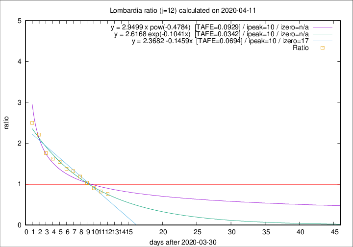

# Lombardia

Data source: https://raw.githubusercontent.com/pcm-dpc/COVID-19/master/dati-json/dpc-covid19-ita-regioni.json

Delta days analysis (j): 12

Analyses for other values of j for 2020-04-11 are avalable [here](../2020-04-11/README.md)

Analyses for Lombardia for previous dates are avalable [here](../README.md)

## Fitting 
|fit type|best fit equation|tafe|tfe|ipeak|izero|
|-------|-----|--------|------|---|---|
|linear|y = 2.3682 -0.1459x  [TAFE=0.0694]|0.0694|-0.0022|10|17|
|exp|y = 2.6168 exp(-0.1041x)  [TAFE=0.0342]|0.0342|0.0011|10|n/a|
|pow|y = 2.9499 x pow(-0.4784)  [TAFE=0.0929]|0.0929|0.0056|10|n/a|

## Data
|Date|Daily deaths|Cumulated deaths|Deaths in the last 12 days|Deaths in the 12 days before|ratio|
|----|----------|-----------|-------|--------------------|-----|
|2020-04-11|273|10511|3693|4859|0.7600|
|2020-04-10|216|10238|3878|4720|0.8216|
|2020-04-09|300|10022|4078|4524|0.9014|
|2020-04-08|238|9722|4320|4184|1.0325|
|2020-04-07|282|9484|4623|3895|1.1869|
|2020-04-06|297|9202|4728|3584|1.3192|
|2020-04-05|249|8905|4727|3434|1.3765|
|2020-04-04|345|8656|4880|3159|1.5448|
|2020-04-03|351|8311|4855|2988|1.6248|
|2020-04-02|367|7960|4865|2762|1.7614|
|2020-04-01|394|7593|5044|2282|2.2103|
|2020-03-31|381|7199|5031|2014|2.4980|

[Download data as CSV](COVID-19_lombardia_j12_2020-04-11.csv)

Generated April 14th, 2020 at 19:16:04 UTC+0200 with https://github.com/robianc/COVID-19
