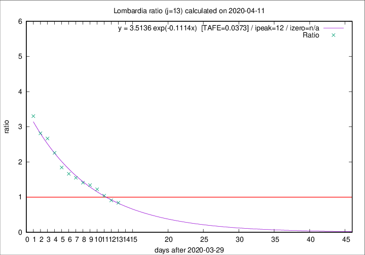

# Lombardia

Data source: https://raw.githubusercontent.com/pcm-dpc/COVID-19/master/dati-json/dpc-covid19-ita-regioni.json

Delta days analysis (j): 13

Analyses for other values of j for 2020-04-11 are avalable [here](../2020-04-11/README.md)

Analyses for Lombardia for previous dates are avalable [here](../README.md)

## Fitting 
|fit type|best fit equation|tafe|tfe|ipeak|izero|
|-------|-----|--------|------|---|---|
|exp|y = 3.5136 exp(-0.1114x)  [TAFE=0.0373]|0.0373|0.0010|12|n/a|

## Data
|Date|Daily deaths|Cumulated deaths|Deaths in the last 13 days|Deaths in the 13 days before|ratio|
|----|----------|-----------|-------|--------------------|-----|
|2020-04-11|273|10511|4151|4940|0.8403|
|2020-04-10|216|10238|4294|4726|0.9086|
|2020-04-09|300|10022|4620|4436|1.0415|
|2020-04-08|238|9722|4861|3971|1.2241|
|2020-04-07|282|9484|5010|3730|1.3432|
|2020-04-06|297|9202|5024|3561|1.4108|
|2020-04-05|249|8905|5129|3308|1.5505|
|2020-04-04|345|8656|5200|3123|1.6651|
|2020-04-03|351|8311|5216|2828|1.8444|
|2020-04-02|367|7960|5411|2395|2.2593|
|2020-04-01|394|7593|5425|2033|2.6685|
|2020-03-31|381|7199|5240|1861|2.8157|
|2020-03-30|458|6818|5178|1567|3.3044|

[Download data as CSV](COVID-19_lombardia_j13_2020-04-11.csv)

Generated April 12th, 2020 at 17:02:01 UTC+0200 with https://github.com/robianc/COVID-19
