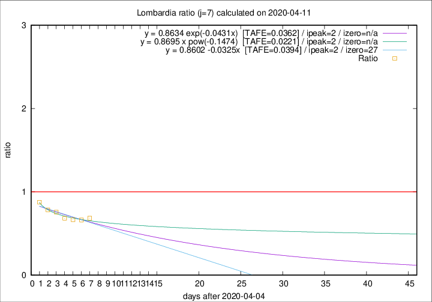

# Lombardia

Data source: https://raw.githubusercontent.com/pcm-dpc/COVID-19/master/dati-json/dpc-covid19-ita-regioni.json

Delta days analysis (j): 7

Analyses for other values of j for 2020-04-11 are avalable [here](../2020-04-11/README.md)

Analyses for Lombardia for previous dates are avalable [here](../README.md)

## Fitting 
|fit type|best fit equation|tafe|tfe|ipeak|izero|
|-------|-----|--------|------|---|---|
|linear|y = 0.8602 -0.0325x  [TAFE=0.0394]|0.0394|0.0021|2|27|
|exp|y = 0.8634 exp(-0.0431x)  [TAFE=0.0362]|0.0362|0.0011|2|n/a|
|pow|y = 0.8695 x pow(-0.1474)  [TAFE=0.0221]|0.0221|0.0004|2|n/a|

## Data
|Date|Daily deaths|Cumulated deaths|Deaths in the last 7 days|Deaths in the 7 days before|ratio|
|----|----------|-----------|-------|--------------------|-----|
|2020-04-11|273|10511|1855|2712|0.6840|
|2020-04-10|216|10238|1927|2909|0.6624|
|2020-04-09|300|10022|2062|3099|0.6654|
|2020-04-08|238|9722|2129|3119|0.6826|
|2020-04-07|282|9484|2285|3021|0.7564|
|2020-04-06|297|9202|2384|3042|0.7837|
|2020-04-05|249|8905|2545|2904|0.8764|

[Download data as CSV](COVID-19_lombardia_j7_2020-04-11.csv)

Generated April 19th, 2020 at 18:42:39 UTC+0200 with https://github.com/robianc/COVID-19
