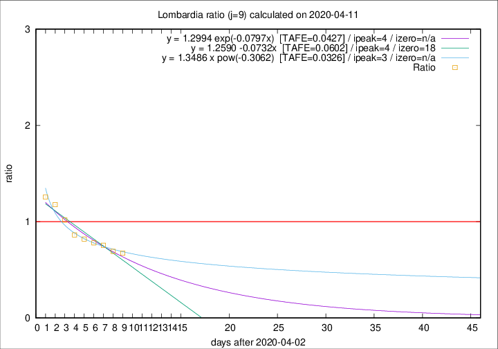

# Lombardia

Data source: https://raw.githubusercontent.com/pcm-dpc/COVID-19/master/dati-json/dpc-covid19-ita-regioni.json

Delta days analysis (j): 9

Analyses for other values of j for 2020-04-11 are avalable [here](../2020-04-11/README.md)

Analyses for Lombardia for previous dates are avalable [here](../README.md)

## Fitting 
|fit type|best fit equation|tafe|tfe|ipeak|izero|
|-------|-----|--------|------|---|---|
|linear|y = 1.2590 -0.0732x  [TAFE=0.0602]|0.0602|0.0024|4|18|
|exp|y = 1.2994 exp(-0.0797x)  [TAFE=0.0427]|0.0427|0.0011|4|n/a|
|pow|y = 1.3486 x pow(-0.3062)  [TAFE=0.0326]|0.0326|0.0008|3|n/a|

## Data
|Date|Daily deaths|Cumulated deaths|Deaths in the last 9 days|Deaths in the 9 days before|ratio|
|----|----------|-----------|-------|--------------------|-----|
|2020-04-11|273|10511|2551|3782|0.6745|
|2020-04-10|216|10238|2645|3817|0.6930|
|2020-04-09|300|10022|2823|3743|0.7542|
|2020-04-08|238|9722|2904|3723|0.7800|
|2020-04-07|282|9484|3124|3811|0.8197|
|2020-04-06|297|9202|3258|3776|0.8628|
|2020-04-05|249|8905|3503|3443|1.0174|
|2020-04-04|345|8656|3795|3221|1.1782|
|2020-04-03|351|8311|3837|3054|1.2564|

[Download data as CSV](COVID-19_lombardia_j9_2020-04-11.csv)

Generated April 19th, 2020 at 18:42:39 UTC+0200 with https://github.com/robianc/COVID-19
