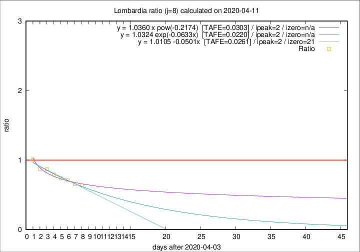

# Lombardia

Data source: https://raw.githubusercontent.com/pcm-dpc/COVID-19/master/dati-json/dpc-covid19-ita-regioni.json

Estimates in this page were made on 19/4/2020 with data available until 11/04/2020.

## Summary 

### Peak estimate 
|j|linear [TAFE]|exponential [TAFE]|power law [TAFE]|details|
|---|----|-----------|---------|-------|
|7|7/4/2020 [TAFE=0.0394]|7/4/2020 [TAFE=0.0362]|7/4/2020 [TAFE=0.0221]|[analysis](COVID-19_lombardia_j7_2020-04-11.md)|
|8|6/4/2020 [TAFE=0.0261]|6/4/2020 [TAFE=0.0220]|6/4/2020 [TAFE=0.0303]|[analysis](COVID-19_lombardia_j8_2020-04-11.md)|
|9|7/4/2020 [TAFE=0.0602]|7/4/2020 [TAFE=0.0427]|6/4/2020 [TAFE=0.0326]|[analysis](COVID-19_lombardia_j9_2020-04-11.md)|
|10|8/4/2020 [TAFE=0.0583]|8/4/2020 [TAFE=0.0411]|7/4/2020 [TAFE=0.0678]|[analysis](COVID-19_lombardia_j10_2020-04-11.md)|
|11|9/4/2020 [TAFE=0.0282]|9/4/2020 [TAFE=0.0291]|8/4/2020 [TAFE=0.1035]|[analysis](COVID-19_lombardia_j11_2020-04-11.md)|
|12|10/4/2020 [TAFE=0.0694]|10/4/2020 [TAFE=0.0342]|10/4/2020 [TAFE=0.0929]|[analysis](COVID-19_lombardia_j12_2020-04-11.md)|
|13|10/4/2020 [TAFE=0.1033]|11/4/2020 [TAFE=0.0373]|13/4/2020 [TAFE=0.1062]|[analysis](COVID-19_lombardia_j13_2020-04-11.md)|
|14|11/4/2020 [TAFE=0.1361]|12/4/2020 [TAFE=0.0406]|17/4/2020 [TAFE=0.1170]|[analysis](COVID-19_lombardia_j14_2020-04-11.md)|

Best estimator is exp with j=8 (TAFE=0.0220)
Corresponding peak date estimate is 6/4/2020 (ipeak 2)

Peak date range estimate: 6/4/2020 - 23/4/2020

### End estimate 
|j|linear [TAFE/TFE]|exponential [TAFE/TFE]|power law [TAFE/TFE]|details|
|---|----|-----------|---------|-------|
|7|2/5/2020 [TAFE=0.0394]|-|-|[analysis](COVID-19_lombardia_j7_2020-04-11.md)|
|8|25/4/2020 [TAFE=0.0261]|-|-|[analysis](COVID-19_lombardia_j8_2020-04-11.md)|
|9|-|-|-|[analysis](COVID-19_lombardia_j9_2020-04-11.md)|
|10|-|-|-|[analysis](COVID-19_lombardia_j10_2020-04-11.md)|
|11|-|-|-|[analysis](COVID-19_lombardia_j11_2020-04-11.md)|
|12|-|-|-|[analysis](COVID-19_lombardia_j12_2020-04-11.md)|
|13|-|-|-|[analysis](COVID-19_lombardia_j13_2020-04-11.md)|
|14|-|-|-|[analysis](COVID-19_lombardia_j14_2020-04-11.md)|

Best estimator is linear with j=8 (TAFE=0.0261)
Corresponding end date estimate is 25/4/2020 (izero 21)

End date range estimate: 4/4/2020 - 1/5/2020

Generated April 19th, 2020 at 18:42:39 UTC+0200 with https://github.com/robianc/COVID-19
