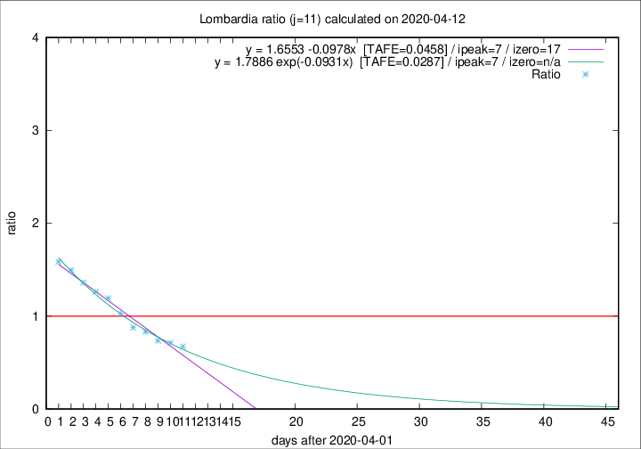

# Lombardia

Data source: https://raw.githubusercontent.com/pcm-dpc/COVID-19/master/dati-json/dpc-covid19-ita-regioni.json

Delta days analysis (j): 11

Analyses for other values of j for 2020-04-12 are avalable [here](../2020-04-12/README.md)

Analyses for Lombardia for previous dates are avalable [here](../README.md)

## Fitting 
|fit type|best fit equation|tafe|tfe|ipeak|izero|
|-------|-----|--------|------|---|---|
|linear|y = 1.6553 -0.0978x  [TAFE=0.0458]|0.0458|0.0000|7|17|
|exp|y = 1.7886 exp(-0.0931x)  [TAFE=0.0287]|0.0287|0.0007|7|n/a|

## Data
|Date|Daily deaths|Cumulated deaths|Deaths in the last 11 days|Deaths in the 11 days before|ratio|
|----|----------|-----------|-------|--------------------|-----|
|2020-04-12|110|10621|3028|4498|0.6732|
|2020-04-11|273|10511|3312|4650|0.7123|
|2020-04-10|216|10238|3420|4650|0.7355|
|2020-04-09|300|10022|3662|4401|0.8321|
|2020-04-08|238|9722|3778|4304|0.8778|
|2020-04-07|282|9484|4082|3982|1.0251|
|2020-04-06|297|9202|4341|3643|1.1916|
|2020-04-05|249|8905|4431|3508|1.2631|
|2020-04-04|345|8656|4478|3288|1.3619|
|2020-04-03|351|8311|4535|3032|1.4957|
|2020-04-02|367|7960|4504|2839|1.5865|

[Download data as CSV](COVID-19_lombardia_j11_2020-04-12.csv)

Generated April 14th, 2020 at 19:16:04 UTC+0200 with https://github.com/robianc/COVID-19
