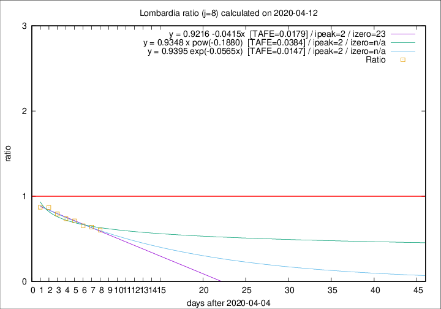

# Lombardia

Data source: https://raw.githubusercontent.com/pcm-dpc/COVID-19/master/dati-json/dpc-covid19-ita-regioni.json

Estimates in this page were made on 12/4/2020 with data available until 12/04/2020.

## Summary 

### Peak estimate 
|j|linear [TAFE]|exponential [TAFE]|power law [TAFE]|details|
|---|----|-----------|---------|-------|
|7|8/4/2020 [TAFE=0.0382]|8/4/2020 [TAFE=0.0374]|8/4/2020 [TAFE=0.0263]|[analysis](COVID-19_lombardia_j7_2020-04-12.md)|
|8|7/4/2020 [TAFE=0.0179]|7/4/2020 [TAFE=0.0147]|7/4/2020 [TAFE=0.0384]|[analysis](COVID-19_lombardia_j8_2020-04-12.md)|
|9|7/4/2020 [TAFE=0.0497]|7/4/2020 [TAFE=0.0362]|6/4/2020 [TAFE=0.0256]|[analysis](COVID-19_lombardia_j9_2020-04-12.md)|
|10|8/4/2020 [TAFE=0.0606]|8/4/2020 [TAFE=0.0429]|7/4/2020 [TAFE=0.0611]|[analysis](COVID-19_lombardia_j10_2020-04-12.md)|
|11|9/4/2020 [TAFE=0.0458]|9/4/2020 [TAFE=0.0287]|8/4/2020 [TAFE=0.0900]|[analysis](COVID-19_lombardia_j11_2020-04-12.md)|
|12|10/4/2020 [TAFE=0.0542]|10/4/2020 [TAFE=0.0286]|9/4/2020 [TAFE=0.1043]|[analysis](COVID-19_lombardia_j12_2020-04-12.md)|
|13|11/4/2020 [TAFE=0.0877]|11/4/2020 [TAFE=0.0352]|12/4/2020 [TAFE=0.1164]|[analysis](COVID-19_lombardia_j13_2020-04-12.md)|
|14|11/4/2020 [TAFE=0.1324]|12/4/2020 [TAFE=0.0411]|15/4/2020 [TAFE=0.1192]|[analysis](COVID-19_lombardia_j14_2020-04-12.md)|

Best estimator is exp with j=8 (TAFE=0.0147)
Corresponding peak date estimate is 7/4/2020 (ipeak 2)

Peak date range estimate: 7/4/2020 - 21/4/2020

### End estimate 
|j|linear [TAFE/TFE]|exponential [TAFE/TFE]|power law [TAFE/TFE]|details|
|---|----|-----------|---------|-------|
|7|20/5/2020 [TAFE=0.0382]|-|-|[analysis](COVID-19_lombardia_j7_2020-04-12.md)|
|8|28/4/2020 [TAFE=0.0179]|-|-|[analysis](COVID-19_lombardia_j8_2020-04-12.md)|
|9|-|-|-|[analysis](COVID-19_lombardia_j9_2020-04-12.md)|
|10|-|-|-|[analysis](COVID-19_lombardia_j10_2020-04-12.md)|
|11|-|-|-|[analysis](COVID-19_lombardia_j11_2020-04-12.md)|
|12|-|-|-|[analysis](COVID-19_lombardia_j12_2020-04-12.md)|
|13|-|-|-|[analysis](COVID-19_lombardia_j13_2020-04-12.md)|
|14|-|-|-|[analysis](COVID-19_lombardia_j14_2020-04-12.md)|

Best estimator is linear with j=8 (TAFE=0.0179)
Corresponding end date estimate is 28/4/2020 (izero 23)

End date range estimate: 5/4/2020 - 19/5/2020

Generated April 12th, 2020 at 16:28:18 UTC+0200 with https://github.com/robianc/COVID-19
