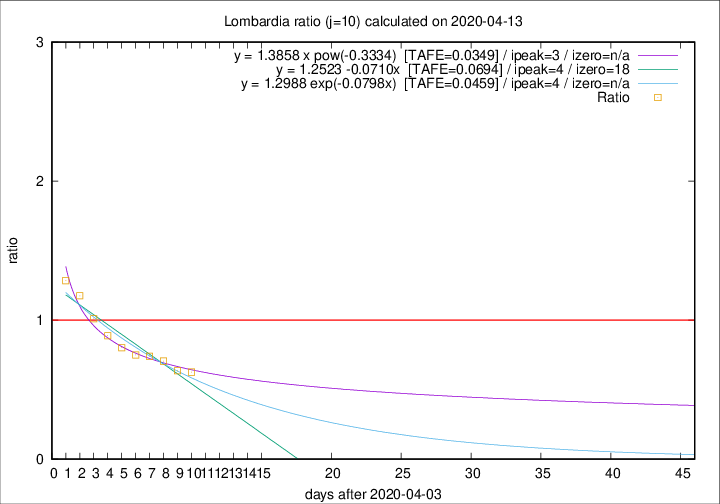

# Lombardia

Data source: https://raw.githubusercontent.com/pcm-dpc/COVID-19/master/dati-json/dpc-covid19-ita-regioni.json

Delta days analysis (j): 10

Analyses for other values of j for 2020-04-13 are avalable [here](../2020-04-13/README.md)

Analyses for Lombardia for previous dates are avalable [here](../README.md)

## Fitting 
|fit type|best fit equation|tafe|tfe|ipeak|izero|
|-------|-----|--------|------|---|---|
|linear|y = 1.2523 -0.0710x  [TAFE=0.0694]|0.0694|0.0023|4|18|
|exp|y = 1.2988 exp(-0.0798x)  [TAFE=0.0459]|0.0459|0.0014|4|n/a|
|pow|y = 1.3858 x pow(-0.3334)  [TAFE=0.0349]|0.0349|0.0009|3|n/a|

## Data
|Date|Daily deaths|Cumulated deaths|Deaths in the last 10 days|Deaths in the 10 days before|ratio|
|----|----------|-----------|-------|--------------------|-----|
|2020-04-13|280|10901|2590|4133|0.6267|
|2020-04-12|110|10621|2661|4184|0.6360|
|2020-04-11|273|10511|2918|4137|0.7053|
|2020-04-10|216|10238|3039|4104|0.7405|
|2020-04-09|300|10022|3204|4269|0.7505|
|2020-04-08|238|9722|3362|4192|0.8020|
|2020-04-07|282|9484|3540|3985|0.8883|
|2020-04-06|297|9202|3800|3762|1.0101|
|2020-04-05|249|8905|4044|3441|1.1752|
|2020-04-04|345|8656|4182|3256|1.2844|

[Download data as CSV](COVID-19_lombardia_j10_2020-04-13.csv)

Generated April 16th, 2020 at 20:09:19 UTC+0200 with https://github.com/robianc/COVID-19
