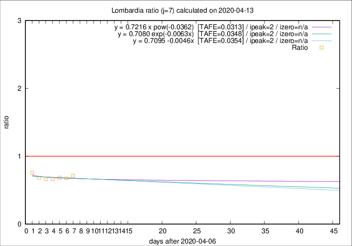

# Lombardia

Data source: https://raw.githubusercontent.com/pcm-dpc/COVID-19/master/dati-json/dpc-covid19-ita-regioni.json

Delta days analysis (j): 7

Analyses for other values of j for 2020-04-13 are avalable [here](../2020-04-13/README.md)

Analyses for Lombardia for previous dates are avalable [here](../README.md)

## Fitting 
|fit type|best fit equation|tafe|tfe|ipeak|izero|
|-------|-----|--------|------|---|---|
|linear|y = 0.7095 -0.0046x  [TAFE=0.0354]|0.0354|0.0017|2|n/a|
|exp|y = 0.7080 exp(-0.0063x)  [TAFE=0.0348]|0.0348|0.0008|2|n/a|
|pow|y = 0.7216 x pow(-0.0362)  [TAFE=0.0313]|0.0313|0.0007|2|n/a|

## Data
|Date|Daily deaths|Cumulated deaths|Deaths in the last 7 days|Deaths in the 7 days before|ratio|
|----|----------|-----------|-------|--------------------|-----|
|2020-04-13|280|10901|1699|2384|0.7127|
|2020-04-12|110|10621|1716|2545|0.6743|
|2020-04-11|273|10511|1855|2712|0.6840|
|2020-04-10|216|10238|1927|2909|0.6624|
|2020-04-09|300|10022|2062|3099|0.6654|
|2020-04-08|238|9722|2129|3119|0.6826|
|2020-04-07|282|9484|2285|3021|0.7564|

[Download data as CSV](COVID-19_lombardia_j7_2020-04-13.csv)

Generated April 16th, 2020 at 20:09:19 UTC+0200 with https://github.com/robianc/COVID-19
