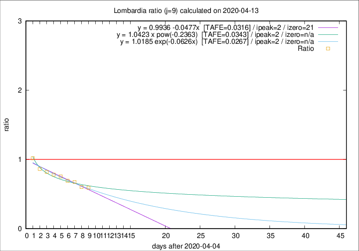

# Lombardia

Data source: https://raw.githubusercontent.com/pcm-dpc/COVID-19/master/dati-json/dpc-covid19-ita-regioni.json

Estimates in this page were made on 19/4/2020 with data available until 13/04/2020.

## Summary 

### Peak estimate 
|j|linear [TAFE]|exponential [TAFE]|power law [TAFE]|details|
|---|----|-----------|---------|-------|
|7|9/4/2020 [TAFE=0.0354]|9/4/2020 [TAFE=0.0348]|9/4/2020 [TAFE=0.0313]|[analysis](COVID-19_lombardia_j7_2020-04-13.md)|
|8|8/4/2020 [TAFE=0.0457]|8/4/2020 [TAFE=0.0426]|8/4/2020 [TAFE=0.0289]|[analysis](COVID-19_lombardia_j8_2020-04-13.md)|
|9|7/4/2020 [TAFE=0.0316]|7/4/2020 [TAFE=0.0267]|7/4/2020 [TAFE=0.0343]|[analysis](COVID-19_lombardia_j9_2020-04-13.md)|
|10|8/4/2020 [TAFE=0.0694]|8/4/2020 [TAFE=0.0459]|7/4/2020 [TAFE=0.0349]|[analysis](COVID-19_lombardia_j10_2020-04-13.md)|
|11|9/4/2020 [TAFE=0.0623]|9/4/2020 [TAFE=0.0361]|8/4/2020 [TAFE=0.0694]|[analysis](COVID-19_lombardia_j11_2020-04-13.md)|
|12|10/4/2020 [TAFE=0.0402]|10/4/2020 [TAFE=0.0279]|9/4/2020 [TAFE=0.1086]|[analysis](COVID-19_lombardia_j12_2020-04-13.md)|
|13|11/4/2020 [TAFE=0.0894]|11/4/2020 [TAFE=0.0374]|11/4/2020 [TAFE=0.1018]|[analysis](COVID-19_lombardia_j13_2020-04-13.md)|
|14|12/4/2020 [TAFE=0.1222]|12/4/2020 [TAFE=0.0416]|13/4/2020 [TAFE=0.1229]|[analysis](COVID-19_lombardia_j14_2020-04-13.md)|

Best estimator is exp with j=9 (TAFE=0.0267)
Corresponding peak date estimate is 7/4/2020 (ipeak 2)

Peak date range estimate: 7/4/2020 - 18/4/2020

### End estimate 
|j|linear [TAFE/TFE]|exponential [TAFE/TFE]|power law [TAFE/TFE]|details|
|---|----|-----------|---------|-------|
|7|-|-|-|[analysis](COVID-19_lombardia_j7_2020-04-13.md)|
|8|3/5/2020 [TAFE=0.0457]|-|-|[analysis](COVID-19_lombardia_j8_2020-04-13.md)|
|9|26/4/2020 [TAFE=0.0316]|-|-|[analysis](COVID-19_lombardia_j9_2020-04-13.md)|
|10|-|-|-|[analysis](COVID-19_lombardia_j10_2020-04-13.md)|
|11|-|-|-|[analysis](COVID-19_lombardia_j11_2020-04-13.md)|
|12|-|-|-|[analysis](COVID-19_lombardia_j12_2020-04-13.md)|
|13|-|-|-|[analysis](COVID-19_lombardia_j13_2020-04-13.md)|
|14|-|-|-|[analysis](COVID-19_lombardia_j14_2020-04-13.md)|

Best estimator is linear with j=9 (TAFE=0.0316)
Corresponding end date estimate is 26/4/2020 (izero 21)

End date range estimate: 5/4/2020 - 2/5/2020

Generated April 19th, 2020 at 18:42:39 UTC+0200 with https://github.com/robianc/COVID-19
