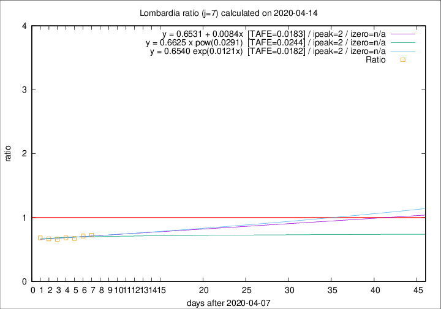

# Lombardia

Data source: https://raw.githubusercontent.com/pcm-dpc/COVID-19/master/dati-json/dpc-covid19-ita-regioni.json

Estimates in this page were made on 16/4/2020 with data available until 14/04/2020.

## Summary 

### Peak estimate 
|j|linear [TAFE]|exponential [TAFE]|power law [TAFE]|details|
|---|----|-----------|---------|-------|
|7|10/4/2020 [TAFE=0.0183]|10/4/2020 [TAFE=0.0182]|10/4/2020 [TAFE=0.0244]|[analysis](COVID-19_lombardia_j7_2020-04-14.md)|
|8|9/4/2020 [TAFE=0.0523]|9/4/2020 [TAFE=0.0517]|9/4/2020 [TAFE=0.0406]|[analysis](COVID-19_lombardia_j8_2020-04-14.md)|
|9|8/4/2020 [TAFE=0.0303]|8/4/2020 [TAFE=0.0279]|8/4/2020 [TAFE=0.0409]|[analysis](COVID-19_lombardia_j9_2020-04-14.md)|
|10|7/4/2020 [TAFE=0.0578]|7/4/2020 [TAFE=0.0423]|7/4/2020 [TAFE=0.0216]|[analysis](COVID-19_lombardia_j10_2020-04-14.md)|
|11|9/4/2020 [TAFE=0.0739]|9/4/2020 [TAFE=0.0469]|8/4/2020 [TAFE=0.0551]|[analysis](COVID-19_lombardia_j11_2020-04-14.md)|
|12|10/4/2020 [TAFE=0.0624]|10/4/2020 [TAFE=0.0354]|9/4/2020 [TAFE=0.0929]|[analysis](COVID-19_lombardia_j12_2020-04-14.md)|
|13|11/4/2020 [TAFE=0.0685]|11/4/2020 [TAFE=0.0328]|10/4/2020 [TAFE=0.1090]|[analysis](COVID-19_lombardia_j13_2020-04-14.md)|
|14|12/4/2020 [TAFE=0.1169]|12/4/2020 [TAFE=0.0426]|12/4/2020 [TAFE=0.1241]|[analysis](COVID-19_lombardia_j14_2020-04-14.md)|

Best estimator is exp with j=7 (TAFE=0.0182)
Corresponding peak date estimate is 10/4/2020 (ipeak 2)

Peak date range estimate: 10/4/2020 - 19/4/2020

### End estimate 
|j|linear [TAFE/TFE]|exponential [TAFE/TFE]|power law [TAFE/TFE]|details|
|---|----|-----------|---------|-------|
|7|-|-|-|[analysis](COVID-19_lombardia_j7_2020-04-14.md)|
|8|22/5/2020 [TAFE=0.0523]|-|-|[analysis](COVID-19_lombardia_j8_2020-04-14.md)|
|9|3/5/2020 [TAFE=0.0303]|-|-|[analysis](COVID-19_lombardia_j9_2020-04-14.md)|
|10|-|-|-|[analysis](COVID-19_lombardia_j10_2020-04-14.md)|
|11|-|-|-|[analysis](COVID-19_lombardia_j11_2020-04-14.md)|
|12|-|-|-|[analysis](COVID-19_lombardia_j12_2020-04-14.md)|
|13|-|-|-|[analysis](COVID-19_lombardia_j13_2020-04-14.md)|
|14|-|-|-|[analysis](COVID-19_lombardia_j14_2020-04-14.md)|

Best estimator is linear with j=9 (TAFE=0.0303)
Corresponding end date estimate is 3/5/2020 (izero 27)

End date range estimate: 6/4/2020 - 21/5/2020

Generated April 16th, 2020 at 20:09:19 UTC+0200 with https://github.com/robianc/COVID-19
