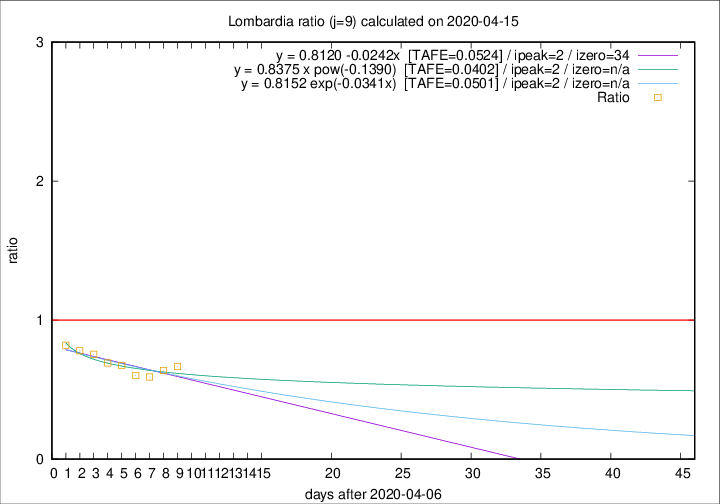

# Lombardia

Data source: https://raw.githubusercontent.com/pcm-dpc/COVID-19/master/dati-json/dpc-covid19-ita-regioni.json

Delta days analysis (j): 9

Analyses for other values of j for 2020-04-15 are avalable [here](../2020-04-15/README.md)

Analyses for Lombardia for previous dates are avalable [here](../README.md)

## Fitting 
|fit type|best fit equation|tafe|tfe|ipeak|izero|
|-------|-----|--------|------|---|---|
|linear|y = 0.8120 -0.0242x  [TAFE=0.0524]|0.0524|0.0032|2|34|
|exp|y = 0.8152 exp(-0.0341x)  [TAFE=0.0501]|0.0501|0.0020|2|n/a|
|pow|y = 0.8375 x pow(-0.1390)  [TAFE=0.0402]|0.0402|0.0012|2|n/a|

## Data
|Date|Daily deaths|Cumulated deaths|Deaths in the last 9 days|Deaths in the 9 days before|ratio|
|----|----------|-----------|-------|--------------------|-----|
|2020-04-15|235|11377|2175|3258|0.6676|
|2020-04-14|241|11142|2237|3503|0.6386|
|2020-04-13|280|10901|2245|3795|0.5916|
|2020-04-12|110|10621|2310|3837|0.6020|
|2020-04-11|273|10511|2551|3782|0.6745|
|2020-04-10|216|10238|2645|3817|0.6930|
|2020-04-09|300|10022|2823|3743|0.7542|
|2020-04-08|238|9722|2904|3723|0.7800|
|2020-04-07|282|9484|3124|3811|0.8197|

[Download data as CSV](COVID-19_lombardia_j9_2020-04-15.csv)

Generated April 19th, 2020 at 18:42:39 UTC+0200 with https://github.com/robianc/COVID-19
