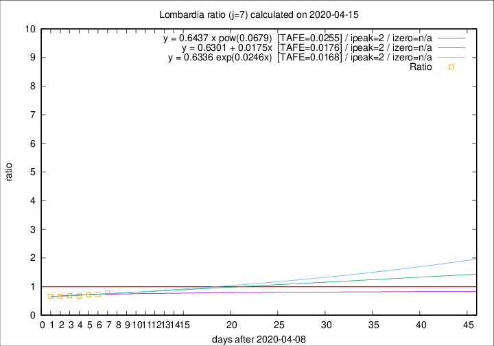

# Lombardia

Data source: https://raw.githubusercontent.com/pcm-dpc/COVID-19/master/dati-json/dpc-covid19-ita-regioni.json

Estimates in this page were made on 19/4/2020 with data available until 15/04/2020.

## Summary 

### Peak estimate 
|j|linear [TAFE]|exponential [TAFE]|power law [TAFE]|details|
|---|----|-----------|---------|-------|
|7|11/4/2020 [TAFE=0.0176]|11/4/2020 [TAFE=0.0168]|11/4/2020 [TAFE=0.0255]|[analysis](COVID-19_lombardia_j7_2020-04-15.md)|
|8|10/4/2020 [TAFE=0.0522]|10/4/2020 [TAFE=0.0525]|10/4/2020 [TAFE=0.0494]|[analysis](COVID-19_lombardia_j8_2020-04-15.md)|
|9|9/4/2020 [TAFE=0.0524]|9/4/2020 [TAFE=0.0501]|9/4/2020 [TAFE=0.0402]|[analysis](COVID-19_lombardia_j9_2020-04-15.md)|
|10|8/4/2020 [TAFE=0.0420]|8/4/2020 [TAFE=0.0329]|8/4/2020 [TAFE=0.0217]|[analysis](COVID-19_lombardia_j10_2020-04-15.md)|
|11|9/4/2020 [TAFE=0.0798]|9/4/2020 [TAFE=0.0550]|8/4/2020 [TAFE=0.0350]|[analysis](COVID-19_lombardia_j11_2020-04-15.md)|
|12|11/4/2020 [TAFE=0.0819]|10/4/2020 [TAFE=0.0508]|9/4/2020 [TAFE=0.0685]|[analysis](COVID-19_lombardia_j12_2020-04-15.md)|
|13|12/4/2020 [TAFE=0.0608]|11/4/2020 [TAFE=0.0307]|10/4/2020 [TAFE=0.1089]|[analysis](COVID-19_lombardia_j13_2020-04-15.md)|
|14|13/4/2020 [TAFE=0.1161]|12/4/2020 [TAFE=0.0463]|12/4/2020 [TAFE=0.1066]|[analysis](COVID-19_lombardia_j14_2020-04-15.md)|

Best estimator is exp with j=7 (TAFE=0.0168)
Corresponding peak date estimate is 11/4/2020 (ipeak 2)

Peak date range estimate: 11/4/2020 - 20/4/2020

### End estimate 
|j|linear [TAFE/TFE]|exponential [TAFE/TFE]|power law [TAFE/TFE]|details|
|---|----|-----------|---------|-------|
|7|-|-|-|[analysis](COVID-19_lombardia_j7_2020-04-15.md)|
|8|-|-|-|[analysis](COVID-19_lombardia_j8_2020-04-15.md)|
|9|11/5/2020 [TAFE=0.0524]|-|-|[analysis](COVID-19_lombardia_j9_2020-04-15.md)|
|10|30/4/2020 [TAFE=0.0420]|-|-|[analysis](COVID-19_lombardia_j10_2020-04-15.md)|
|11|-|-|-|[analysis](COVID-19_lombardia_j11_2020-04-15.md)|
|12|-|-|-|[analysis](COVID-19_lombardia_j12_2020-04-15.md)|
|13|-|-|-|[analysis](COVID-19_lombardia_j13_2020-04-15.md)|
|14|-|-|-|[analysis](COVID-19_lombardia_j14_2020-04-15.md)|

Best estimator is linear with j=10 (TAFE=0.0420)
Corresponding end date estimate is 30/4/2020 (izero 24)

End date range estimate: 6/4/2020 - 10/5/2020

Generated April 19th, 2020 at 18:42:39 UTC+0200 with https://github.com/robianc/COVID-19
