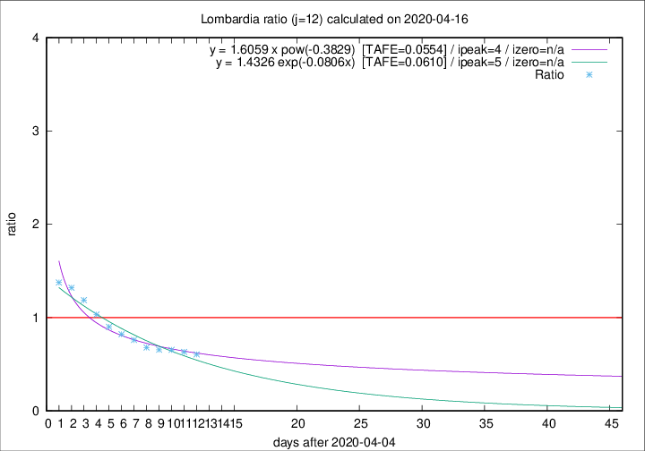

# Lombardia

Data source: https://raw.githubusercontent.com/pcm-dpc/COVID-19/master/dati-json/dpc-covid19-ita-regioni.json

Delta days analysis (j): 12

Analyses for other values of j for 2020-04-16 are avalable [here](../2020-04-16/README.md)

Analyses for Lombardia for previous dates are avalable [here](../README.md)

## Fitting 
|fit type|best fit equation|tafe|tfe|ipeak|izero|
|-------|-----|--------|------|---|---|
|exp|y = 1.4326 exp(-0.0806x)  [TAFE=0.0610]|0.0610|0.0019|5|n/a|
|pow|y = 1.6059 x pow(-0.3829)  [TAFE=0.0554]|0.0554|0.0025|4|n/a|

## Data
|Date|Daily deaths|Cumulated deaths|Deaths in the last 12 days|Deaths in the 12 days before|ratio|
|----|----------|-----------|-------|--------------------|-----|
|2020-04-16|231|11608|2952|4880|0.6049|
|2020-04-15|235|11377|3066|4855|0.6315|
|2020-04-14|241|11142|3182|4865|0.6541|
|2020-04-13|280|10901|3308|5044|0.6558|
|2020-04-12|110|10621|3422|5031|0.6802|
|2020-04-11|273|10511|3693|4859|0.7600|
|2020-04-10|216|10238|3878|4720|0.8216|
|2020-04-09|300|10022|4078|4524|0.9014|
|2020-04-08|238|9722|4320|4184|1.0325|
|2020-04-07|282|9484|4623|3895|1.1869|
|2020-04-06|297|9202|4728|3584|1.3192|
|2020-04-05|249|8905|4727|3434|1.3765|

[Download data as CSV](COVID-19_lombardia_j12_2020-04-16.csv)

Generated April 19th, 2020 at 18:42:39 UTC+0200 with https://github.com/robianc/COVID-19
