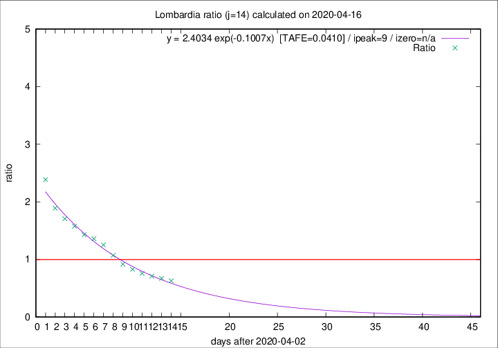

# Lombardia

Data source: https://raw.githubusercontent.com/pcm-dpc/COVID-19/master/dati-json/dpc-covid19-ita-regioni.json

Delta days analysis (j): 14

Analyses for other values of j for 2020-04-16 are avalable [here](../2020-04-16/README.md)

Analyses for Lombardia for previous dates are avalable [here](../README.md)

## Fitting 
|fit type|best fit equation|tafe|tfe|ipeak|izero|
|-------|-----|--------|------|---|---|
|exp|y = 2.4034 exp(-0.1007x)  [TAFE=0.0410]|0.0410|0.0012|9|n/a|

## Data
|Date|Daily deaths|Cumulated deaths|Deaths in the last 14 days|Deaths in the 14 days before|ratio|
|----|----------|-----------|-------|--------------------|-----|
|2020-04-16|231|11608|3648|5792|0.6298|
|2020-04-15|235|11377|3784|5634|0.6716|
|2020-04-14|241|11142|3943|5559|0.7093|
|2020-04-13|280|10901|4083|5398|0.7564|
|2020-04-12|110|10621|4261|5142|0.8287|
|2020-04-11|273|10511|4567|4978|0.9174|
|2020-04-10|216|10238|4836|4512|1.0718|
|2020-04-09|300|10022|5161|4117|1.2536|
|2020-04-08|238|9722|5248|3857|1.3606|
|2020-04-07|282|9484|5306|3710|1.4302|
|2020-04-06|297|9202|5426|3443|1.5760|
|2020-04-05|249|8905|5449|3189|1.7087|
|2020-04-04|345|8656|5561|2941|1.8909|
|2020-04-03|351|8311|5762|2414|2.3869|

[Download data as CSV](COVID-19_lombardia_j14_2020-04-16.csv)

Generated April 19th, 2020 at 18:42:39 UTC+0200 with https://github.com/robianc/COVID-19
