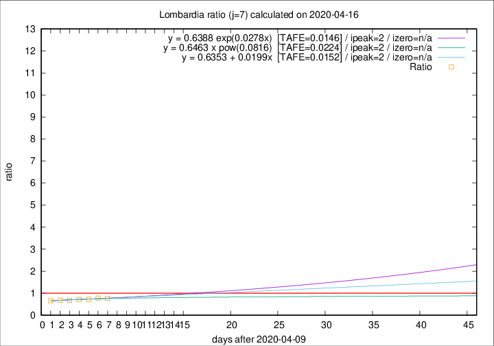

# Lombardia

Data source: https://raw.githubusercontent.com/pcm-dpc/COVID-19/master/dati-json/dpc-covid19-ita-regioni.json

Delta days analysis (j): 7

Analyses for other values of j for 2020-04-16 are avalable [here](../2020-04-16/README.md)

Analyses for Lombardia for previous dates are avalable [here](../README.md)

## Fitting 
|fit type|best fit equation|tafe|tfe|ipeak|izero|
|-------|-----|--------|------|---|---|
|linear|y = 0.6353 + 0.0199x  [TAFE=0.0152]|0.0152|0.0001|2|n/a|
|exp|y = 0.6388 exp(0.0278x)  [TAFE=0.0146]|0.0146|0.0003|2|n/a|
|pow|y = 0.6463 x pow(0.0816)  [TAFE=0.0224]|0.0224|0.0003|2|n/a|

## Data
|Date|Daily deaths|Cumulated deaths|Deaths in the last 7 days|Deaths in the 7 days before|ratio|
|----|----------|-----------|-------|--------------------|-----|
|2020-04-16|231|11608|1586|2062|0.7692|
|2020-04-15|235|11377|1655|2129|0.7774|
|2020-04-14|241|11142|1658|2285|0.7256|
|2020-04-13|280|10901|1699|2384|0.7127|
|2020-04-12|110|10621|1716|2545|0.6743|
|2020-04-11|273|10511|1855|2712|0.6840|
|2020-04-10|216|10238|1927|2909|0.6624|

[Download data as CSV](COVID-19_lombardia_j7_2020-04-16.csv)

Generated April 19th, 2020 at 18:42:39 UTC+0200 with https://github.com/robianc/COVID-19
