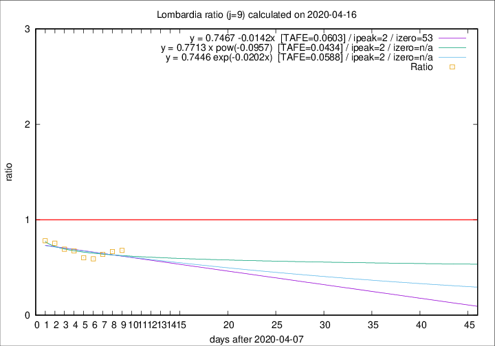

# Lombardia

Data source: https://raw.githubusercontent.com/pcm-dpc/COVID-19/master/dati-json/dpc-covid19-ita-regioni.json

Delta days analysis (j): 9

Analyses for other values of j for 2020-04-16 are avalable [here](../2020-04-16/README.md)

Analyses for Lombardia for previous dates are avalable [here](../README.md)

## Fitting 
|fit type|best fit equation|tafe|tfe|ipeak|izero|
|-------|-----|--------|------|---|---|
|linear|y = 0.7467 -0.0142x  [TAFE=0.0603]|0.0603|0.0048|2|53|
|exp|y = 0.7446 exp(-0.0202x)  [TAFE=0.0588]|0.0588|0.0023|2|n/a|
|pow|y = 0.7713 x pow(-0.0957)  [TAFE=0.0434]|0.0434|0.0016|2|n/a|

## Data
|Date|Daily deaths|Cumulated deaths|Deaths in the last 9 days|Deaths in the 9 days before|ratio|
|----|----------|-----------|-------|--------------------|-----|
|2020-04-16|231|11608|2124|3124|0.6799|
|2020-04-15|235|11377|2175|3258|0.6676|
|2020-04-14|241|11142|2237|3503|0.6386|
|2020-04-13|280|10901|2245|3795|0.5916|
|2020-04-12|110|10621|2310|3837|0.6020|
|2020-04-11|273|10511|2551|3782|0.6745|
|2020-04-10|216|10238|2645|3817|0.6930|
|2020-04-09|300|10022|2823|3743|0.7542|
|2020-04-08|238|9722|2904|3723|0.7800|

[Download data as CSV](COVID-19_lombardia_j9_2020-04-16.csv)

Generated April 19th, 2020 at 18:42:39 UTC+0200 with https://github.com/robianc/COVID-19
