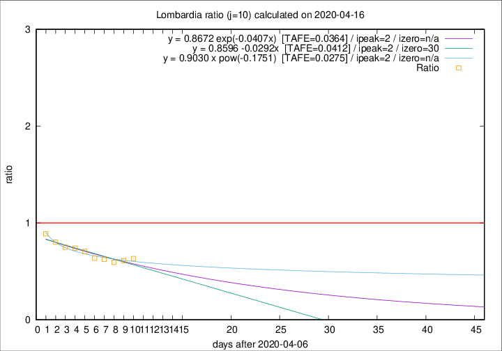

# Lombardia

Data source: https://raw.githubusercontent.com/pcm-dpc/COVID-19/master/dati-json/dpc-covid19-ita-regioni.json

Estimates in this page were made on 19/4/2020 with data available until 16/04/2020.

## Summary 

### Peak estimate 
|j|linear [TAFE]|exponential [TAFE]|power law [TAFE]|details|
|---|----|-----------|---------|-------|
|7|12/4/2020 [TAFE=0.0152]|12/4/2020 [TAFE=0.0146]|12/4/2020 [TAFE=0.0224]|[analysis](COVID-19_lombardia_j7_2020-04-16.md)|
|8|11/4/2020 [TAFE=0.0426]|11/4/2020 [TAFE=0.0420]|11/4/2020 [TAFE=0.0498]|[analysis](COVID-19_lombardia_j8_2020-04-16.md)|
|9|10/4/2020 [TAFE=0.0603]|10/4/2020 [TAFE=0.0588]|10/4/2020 [TAFE=0.0434]|[analysis](COVID-19_lombardia_j9_2020-04-16.md)|
|10|9/4/2020 [TAFE=0.0412]|9/4/2020 [TAFE=0.0364]|9/4/2020 [TAFE=0.0275]|[analysis](COVID-19_lombardia_j10_2020-04-16.md)|
|11|8/4/2020 [TAFE=0.0766]|8/4/2020 [TAFE=0.0568]|8/4/2020 [TAFE=0.0161]|[analysis](COVID-19_lombardia_j11_2020-04-16.md)|
|12|10/4/2020 [TAFE=0.0944]|10/4/2020 [TAFE=0.0610]|9/4/2020 [TAFE=0.0554]|[analysis](COVID-19_lombardia_j12_2020-04-16.md)|
|13|12/4/2020 [TAFE=0.0786]|11/4/2020 [TAFE=0.0447]|10/4/2020 [TAFE=0.0934]|[analysis](COVID-19_lombardia_j13_2020-04-16.md)|
|14|13/4/2020 [TAFE=0.0934]|12/4/2020 [TAFE=0.0410]|11/4/2020 [TAFE=0.1085]|[analysis](COVID-19_lombardia_j14_2020-04-16.md)|

Best estimator is exp with j=7 (TAFE=0.0146)
Corresponding peak date estimate is 12/4/2020 (ipeak 2)

Peak date range estimate: 12/4/2020 - 20/4/2020

### End estimate 
|j|linear [TAFE/TFE]|exponential [TAFE/TFE]|power law [TAFE/TFE]|details|
|---|----|-----------|---------|-------|
|7|-|-|-|[analysis](COVID-19_lombardia_j7_2020-04-16.md)|
|8|-|-|-|[analysis](COVID-19_lombardia_j8_2020-04-16.md)|
|9|31/5/2020 [TAFE=0.0603]|-|-|[analysis](COVID-19_lombardia_j9_2020-04-16.md)|
|10|7/5/2020 [TAFE=0.0412]|-|-|[analysis](COVID-19_lombardia_j10_2020-04-16.md)|
|11|-|-|-|[analysis](COVID-19_lombardia_j11_2020-04-16.md)|
|12|-|-|-|[analysis](COVID-19_lombardia_j12_2020-04-16.md)|
|13|-|-|-|[analysis](COVID-19_lombardia_j13_2020-04-16.md)|
|14|-|-|-|[analysis](COVID-19_lombardia_j14_2020-04-16.md)|

Best estimator is linear with j=10 (TAFE=0.0412)
Corresponding end date estimate is 7/5/2020 (izero 30)

End date range estimate: 7/4/2020 - 30/5/2020

Generated April 19th, 2020 at 18:42:39 UTC+0200 with https://github.com/robianc/COVID-19
