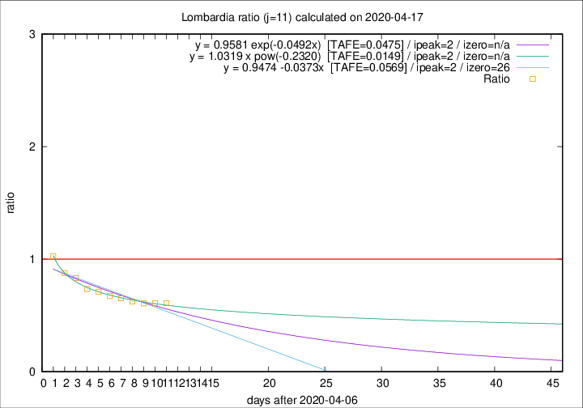

# Lombardia

Data source: https://raw.githubusercontent.com/pcm-dpc/COVID-19/master/dati-json/dpc-covid19-ita-regioni.json

Delta days analysis (j): 11

Analyses for other values of j for 2020-04-17 are avalable [here](../2020-04-17/README.md)

Analyses for Lombardia for previous dates are avalable [here](../README.md)

## Fitting 
|fit type|best fit equation|tafe|tfe|ipeak|izero|
|-------|-----|--------|------|---|---|
|linear|y = 0.9474 -0.0373x  [TAFE=0.0569]|0.0569|0.0031|2|26|
|exp|y = 0.9581 exp(-0.0492x)  [TAFE=0.0475]|0.0475|0.0014|2|n/a|
|pow|y = 1.0319 x pow(-0.2320)  [TAFE=0.0149]|0.0149|0.0002|2|n/a|

## Data
|Date|Daily deaths|Cumulated deaths|Deaths in the last 11 days|Deaths in the 11 days before|ratio|
|----|----------|-----------|-------|--------------------|-----|
|2020-04-17|243|11851|2649|4341|0.6102|
|2020-04-16|231|11608|2703|4431|0.6100|
|2020-04-15|235|11377|2721|4478|0.6076|
|2020-04-14|241|11142|2831|4535|0.6243|
|2020-04-13|280|10901|2941|4504|0.6530|
|2020-04-12|110|10621|3028|4498|0.6732|
|2020-04-11|273|10511|3312|4650|0.7123|
|2020-04-10|216|10238|3420|4650|0.7355|
|2020-04-09|300|10022|3662|4401|0.8321|
|2020-04-08|238|9722|3778|4304|0.8778|
|2020-04-07|282|9484|4082|3982|1.0251|

[Download data as CSV](COVID-19_lombardia_j11_2020-04-17.csv)

Generated April 19th, 2020 at 18:42:39 UTC+0200 with https://github.com/robianc/COVID-19
