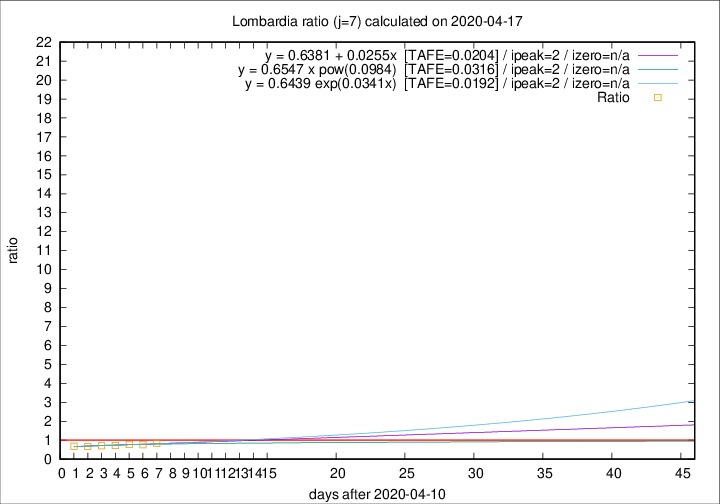

# Lombardia

Data source: https://raw.githubusercontent.com/pcm-dpc/COVID-19/master/dati-json/dpc-covid19-ita-regioni.json

Delta days analysis (j): 7

Analyses for other values of j for 2020-04-17 are avalable [here](../2020-04-17/README.md)

Analyses for Lombardia for previous dates are avalable [here](../README.md)

## Fitting 
|fit type|best fit equation|tafe|tfe|ipeak|izero|
|-------|-----|--------|------|---|---|
|linear|y = 0.6381 + 0.0255x  [TAFE=0.0204]|0.0204|0.0005|2|n/a|
|exp|y = 0.6439 exp(0.0341x)  [TAFE=0.0192]|0.0192|0.0001|2|n/a|
|pow|y = 0.6547 x pow(0.0984)  [TAFE=0.0316]|0.0316|0.0005|2|n/a|

## Data
|Date|Daily deaths|Cumulated deaths|Deaths in the last 7 days|Deaths in the 7 days before|ratio|
|----|----------|-----------|-------|--------------------|-----|
|2020-04-17|243|11851|1613|1927|0.8371|
|2020-04-16|231|11608|1586|2062|0.7692|
|2020-04-15|235|11377|1655|2129|0.7774|
|2020-04-14|241|11142|1658|2285|0.7256|
|2020-04-13|280|10901|1699|2384|0.7127|
|2020-04-12|110|10621|1716|2545|0.6743|
|2020-04-11|273|10511|1855|2712|0.6840|

[Download data as CSV](COVID-19_lombardia_j7_2020-04-17.csv)

Generated April 19th, 2020 at 18:42:39 UTC+0200 with https://github.com/robianc/COVID-19
