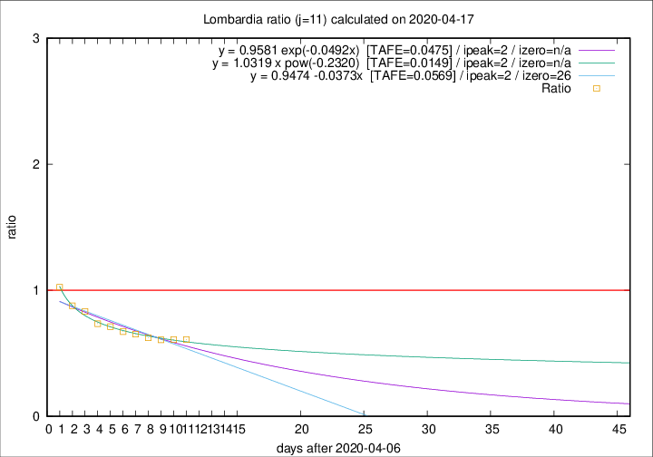
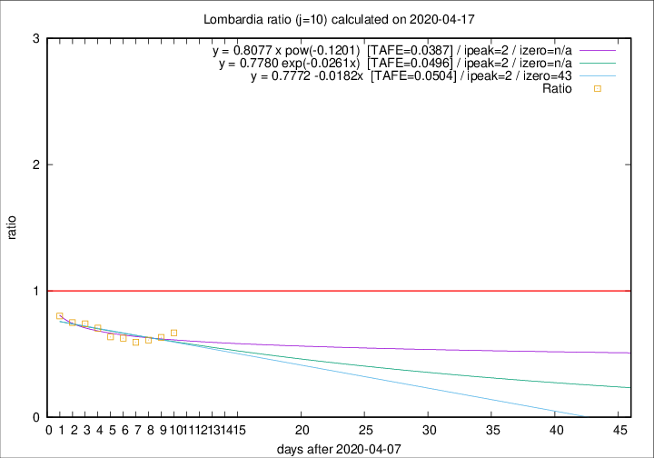

# Lombardia

Data source: https://raw.githubusercontent.com/pcm-dpc/COVID-19/master/dati-json/dpc-covid19-ita-regioni.json

Estimates in this page were made on 19/4/2020 with data available until 17/04/2020.

## Summary 

### Peak estimate 
|j|linear [TAFE]|exponential [TAFE]|power law [TAFE]|details|
|---|----|-----------|---------|-------|
|7|13/4/2020 [TAFE=0.0204]|13/4/2020 [TAFE=0.0192]|13/4/2020 [TAFE=0.0316]|[analysis](COVID-19_lombardia_j7_2020-04-17.md)|
|8|12/4/2020 [TAFE=0.0236]|12/4/2020 [TAFE=0.0229]|12/4/2020 [TAFE=0.0385]|[analysis](COVID-19_lombardia_j8_2020-04-17.md)|
|9|11/4/2020 [TAFE=0.0603]|11/4/2020 [TAFE=0.0610]|11/4/2020 [TAFE=0.0574]|[analysis](COVID-19_lombardia_j9_2020-04-17.md)|
|10|10/4/2020 [TAFE=0.0504]|10/4/2020 [TAFE=0.0496]|10/4/2020 [TAFE=0.0387]|[analysis](COVID-19_lombardia_j10_2020-04-17.md)|
|11|9/4/2020 [TAFE=0.0569]|9/4/2020 [TAFE=0.0475]|9/4/2020 [TAFE=0.0149]|[analysis](COVID-19_lombardia_j11_2020-04-17.md)|
|12|10/4/2020 [TAFE=0.0978]|10/4/2020 [TAFE=0.0708]|9/4/2020 [TAFE=0.0353]|[analysis](COVID-19_lombardia_j12_2020-04-17.md)|
|13|12/4/2020 [TAFE=0.1000]|11/4/2020 [TAFE=0.0619]|10/4/2020 [TAFE=0.0730]|[analysis](COVID-19_lombardia_j13_2020-04-17.md)|
|14|13/4/2020 [TAFE=0.0805]|12/4/2020 [TAFE=0.0364]|11/4/2020 [TAFE=0.1085]|[analysis](COVID-19_lombardia_j14_2020-04-17.md)|

Best estimator is pow with j=11 (TAFE=0.0149)
Corresponding peak date estimate is 9/4/2020 (ipeak 2)

Peak date range estimate: 9/4/2020 - 16/4/2020

### End estimate 
|j|linear [TAFE/TFE]|exponential [TAFE/TFE]|power law [TAFE/TFE]|details|
|---|----|-----------|---------|-------|
|7|-|-|-|[analysis](COVID-19_lombardia_j7_2020-04-17.md)|
|8|-|-|-|[analysis](COVID-19_lombardia_j8_2020-04-17.md)|
|9|-|-|-|[analysis](COVID-19_lombardia_j9_2020-04-17.md)|
|10|21/5/2020 [TAFE=0.0504]|-|-|[analysis](COVID-19_lombardia_j10_2020-04-17.md)|
|11|-|-|-|[analysis](COVID-19_lombardia_j11_2020-04-17.md)|
|12|-|-|-|[analysis](COVID-19_lombardia_j12_2020-04-17.md)|
|13|-|-|-|[analysis](COVID-19_lombardia_j13_2020-04-17.md)|
|14|-|-|-|[analysis](COVID-19_lombardia_j14_2020-04-17.md)|

Best estimator is linear with j=10 (TAFE=0.0504)
Corresponding end date estimate is 21/5/2020 (izero 43)

End date range estimate: 8/4/2020 - 21/5/2020

Generated April 19th, 2020 at 18:42:39 UTC+0200 with https://github.com/robianc/COVID-19
