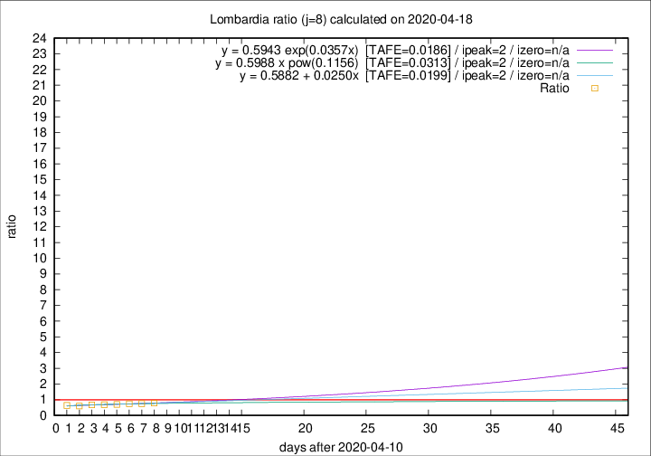

# Lombardia

Data source: https://raw.githubusercontent.com/pcm-dpc/COVID-19/master/dati-json/dpc-covid19-ita-regioni.json

Delta days analysis (j): 8

Analyses for other values of j for 2020-04-18 are avalable [here](../2020-04-18/README.md)

Analyses for Lombardia for previous dates are avalable [here](../README.md)

## Fitting 
|fit type|best fit equation|tafe|tfe|ipeak|izero|
|-------|-----|--------|------|---|---|
|linear|y = 0.5882 + 0.0250x  [TAFE=0.0199]|0.0199|0.0009|2|n/a|
|exp|y = 0.5943 exp(0.0357x)  [TAFE=0.0186]|0.0186|0.0002|2|n/a|
|pow|y = 0.5988 x pow(0.1156)  [TAFE=0.0313]|0.0313|0.0007|2|n/a|

## Data
|Date|Daily deaths|Cumulated deaths|Deaths in the last 8 days|Deaths in the 8 days before|ratio|
|----|----------|-----------|-------|--------------------|-----|
|2020-04-18|199|12050|1812|2278|0.7954|
|2020-04-17|243|11851|1829|2429|0.7530|
|2020-04-16|231|11608|1886|2523|0.7475|
|2020-04-15|235|11377|1893|2666|0.7101|
|2020-04-14|241|11142|1940|2842|0.6826|
|2020-04-13|280|10901|1996|2961|0.6741|
|2020-04-12|110|10621|1965|3254|0.6039|
|2020-04-11|273|10511|2200|3450|0.6377|

[Download data as CSV](COVID-19_lombardia_j8_2020-04-18.csv)

Generated April 19th, 2020 at 18:42:39 UTC+0200 with https://github.com/robianc/COVID-19
